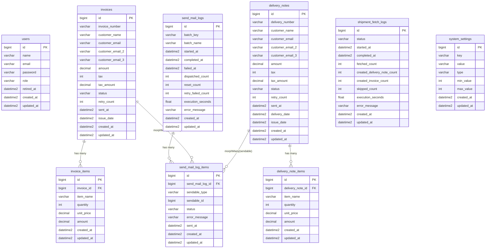

# 請求書メール配信システム DB設計書

> リバース元: `請求書メール配信システム仕様.md` / `design/detailed-design.md`
> 作成日: 2026-06-29 / 作成: db-designer
> DB: SQL Server（sqlsrv）/ DB名: `ePostCable` / ホスト: `db-sv03.solid-corp.local:1433`（BR-10）
> ORM: Laravel Eloquent / マイグレーション: Laravel 標準（`database/migrations/`）
> 注記の扱い: 全論点（OQ-01〜12・DB-Q-01/02）は2026-07-01のヒアリングで解消済み。決定内容を本文へ反映済み（詳細は6章・`design/questions.md`参照）。

---

## 0. 本書の読み方

- §1 ER図でテーブル間リレーションを把握し、§2 テーブル定義で個別カラムを確認する。
- §3 インデックス設計は、詳細設計のクエリパターン（NFR-P-02/03）と対応づけて読む。
- §4 マスタデータ・初期データは環境構築時に `php artisan db:seed` で投入する。
- §5 マイグレーション方針は Laravel 規約に則る。
- SQL Server 固有の留意点は各節末尾の「SQL Server 注記」にまとめた。

---

## 1. ER図（Mermaid erDiagram）



### 1.1 ポリモーフィック関連の補足

`send_mail_log_items` テーブルは `sendable_type` / `sendable_id` の組合せで Invoice と DeliveryNote の両方を参照する Eloquent morphMany 関連である。モジュール型構成（`Modules\Invoice\Models\Invoice` 等）を採用するため、実クラスの完全修飾名ではなく `Relation::morphMap()` による論理名を格納する（Q-15 決定・2026-07-06）。

| sendable_type の格納値 | 参照先テーブル | 参照カラム |
|----------------------|--------------|-----------|
| `invoice`（morphMap） | invoices | id |
| `delivery_note`（morphMap） | delivery_notes | id |

SQL Server には RDBMS ネイティブのポリモーフィック外部キー制約が存在しないため、アプリケーション層（Eloquent）で整合性を担保する（NFR-E-02）。

---

## 2. テーブル定義

> SQL Server 共通注記:
> - 主キーは `bigint IDENTITY(1,1)` を使用（Laravel の `$table->id()` が生成）。
> - 文字列型: 日本語を含む列も含め、全て `varchar` で統一する（`nvarchar` は使用しない・Q-17決定）。照合順序は日本語対応（Japanese_CI_AS等）で設定済みのため、varchar でも日本語を正しく格納できる（2026-07-02決定・Q-13）。
> - 日時型: Laravel `datetime2` マッピング（精度7）。`timestamp` は SQL Server では使用不可。
> - `decimal` は `decimal(p, s)` で精度を明示する。

---

### 2.1 users

ログインユーザーを管理する。role で権限を区別し、retired_at で退職者を識別する（FR-12 / FR-16 / BR-08）。

```sql
CREATE TABLE users (
    id              bigint          NOT NULL IDENTITY(1,1),
    name            varchar(255)   NOT NULL,                          -- 表示名（日本語を含む）
    email           varchar(255)    NOT NULL,                          -- ログインID・unique制約
    password        varchar(255)    NOT NULL,                          -- bcrypt ハッシュ
    role            varchar(20)     NOT NULL DEFAULT 'general',        -- 'general' | 'admin'
    retired_at      datetime2       NULL     DEFAULT NULL,             -- NULL=現役 / 日時=退職済み
    remember_token  varchar(100)    NULL     DEFAULT NULL,             -- Laravel remember me
    created_at      datetime2       NULL     DEFAULT NULL,
    updated_at      datetime2       NULL     DEFAULT NULL,

    CONSTRAINT pk_users PRIMARY KEY (id),
    CONSTRAINT uq_users_email UNIQUE (email),
    CONSTRAINT ck_users_role CHECK (role IN ('general', 'admin'))
);
```

**カラム補足**:

| カラム | 型 | NULL | 説明 |
|-------|----|------|------|
| name | varchar(255) | NOT NULL | 日本語姓名を格納するため varchar |
| email | varchar(255) | NOT NULL | ASCII のみ想定。unique 制約（BR-08） |
| password | varchar(255) | NOT NULL | Laravel bcrypt ハッシュ文字列 |
| role | varchar(20) | NOT NULL | 'general'（一般）/ 'admin'（管理者）。CHECK 制約で列挙値を強制 |
| retired_at | datetime2 | NULL | NULL なら現役。`isRetired()` は `retired_at IS NOT NULL` を返す（NFR-S-04） |

---

### 2.2 invoices

出荷取得バッチで作成される請求書本体（FR-01 / BR-01 / BR-02）。

```sql
CREATE TABLE invoices (
    id                  bigint          NOT NULL IDENTITY(1,1),
    invoice_number      varchar(100)    NOT NULL,                      -- 請求書番号・unique制約（BR-05）
    customer_name       varchar(255)   NOT NULL,                      -- 顧客名（日本語）
    customer_email      varchar(255)    NOT NULL,                      -- 送付先1（recipientEmails[0]）。空白のみは出荷取得バッチでバリデーション（2026-07-01決定・Q-09）
    customer_email_2    varchar(255)    NULL     DEFAULT NULL,         -- 送付先2（recipientEmails[1]）
    customer_email_3    varchar(255)    NULL     DEFAULT NULL,         -- 送付先3（recipientEmails[2]）
    amount              decimal(14, 0)  NOT NULL,                      -- 税抜金額（円）
    tax                 decimal(12, 0)  NOT NULL DEFAULT 10,           -- 税率（%）。BR-02 注記参照
    tax_amount          decimal(14, 0)  NOT NULL,                      -- 税額（円）= round(amount×tax/100)
    status              varchar(30)     NOT NULL DEFAULT 'pending',    -- BR-01 状態遷移参照
    retry_count         int             NOT NULL DEFAULT 0,            -- 自動/手動リトライ累積回数。記録用カウンタとして確定（2026-07-01決定・Q-05）
    sent_at             datetime2       NULL     DEFAULT NULL,         -- 送信成功日時
    issue_date          datetime2       NULL     DEFAULT NULL,         -- 請求日（PDF パス年月基準）
    created_at          datetime2       NULL     DEFAULT NULL,
    updated_at          datetime2       NULL     DEFAULT NULL,

    CONSTRAINT pk_invoices PRIMARY KEY (id),
    CONSTRAINT uq_invoices_invoice_number UNIQUE (invoice_number),
    CONSTRAINT ck_invoices_status CHECK (
        status IN ('pending', 'processing', 'sent', 'failed', 'failed_permanent')
    )
);
```

**カラム補足**:

| カラム | 型 | NULL | 説明 |
|-------|----|------|------|
| invoice_number | varchar(100) | NOT NULL | 重複スキップキー（BR-05）。基幹システム付番 |
| customer_email | varchar(255) | NOT NULL | 主送付先。空白のみ文字列は出荷取得バッチでバリデーションしスキップ（2026-07-01決定・Q-09） |
| customer_email_2/3 | varchar(255) | NULL | 追加送付先。未設定時 NULL |
| amount | decimal(14, 0) | NOT NULL | 税抜金額（整数円）。桁数は最大14桁想定 |
| tax | decimal(12, 0) | NOT NULL | **税率（%）**。現行は10固定（BR-02）。金額編集機能は将来も追加しないため型変更は不要。`decimal(12,0)` のまま確定（2026-07-01決定・Q-02） |
| tax_amount | decimal(14, 0) | NOT NULL | **税額（円）**。`round(amount × tax / 100)` で算出。tax（率）と tax_amount（額）は命名が類似するため混同注意（BR-02） |
| status | varchar(30) | NOT NULL | pending / processing / sent / failed / failed_permanent（BR-01）|
| retry_count | int | NOT NULL | ジョブ自動リトライ・stuck 差し戻し・bulkRequeue の累積回数。記録用カウンタとして確定。ジョブ自動リトライとは非連動（2026-07-01決定・Q-05） |
| issue_date | datetime2 | NULL | PDF 保存パスの `{年}/{月}` 基準（FR-05） |

**tax / tax_amount の設計上の注意（BR-02）**:
- `tax` は税率（例: `10` = 10%）であり、税額ではない。
- `tax_amount` が税額（円）。
- 命名の類似性から混同が起きやすい。コード上でコメントを徹底すること。
- 金額編集機能は将来も追加しないため小数税率対応は不要。詳細設計の `decimal(12,0)` 指定のまま確定（2026-07-01決定・Q-02）。

---

### 2.3 invoice_items

請求書明細。親 invoices との FK は cascade delete（BR-09）。

```sql
CREATE TABLE invoice_items (
    id              bigint          NOT NULL IDENTITY(1,1),
    invoice_id      bigint          NOT NULL,                          -- invoices.id 参照
    item_name       varchar(500)   NOT NULL,                          -- 品目名（日本語）
    quantity        int             NOT NULL DEFAULT 1,                -- 数量
    unit_price      decimal(14, 0)  NOT NULL DEFAULT 0,               -- 単価（円）
    amount          decimal(14, 0)  NOT NULL DEFAULT 0,               -- 金額（円）= quantity × unit_price
    sort_order      int             NULL     DEFAULT NULL,             -- 並び順（基幹システム由来）
    created_at      datetime2       NULL     DEFAULT NULL,
    updated_at      datetime2       NULL     DEFAULT NULL,

    CONSTRAINT pk_invoice_items PRIMARY KEY (id),
    CONSTRAINT fk_invoice_items_invoice_id
        FOREIGN KEY (invoice_id) REFERENCES invoices (id)
        ON DELETE CASCADE
        ON UPDATE NO ACTION
);
```

**カラム補足**:

| カラム | 型 | NULL | 説明 |
|-------|----|------|------|
| item_name | varchar(500) | NOT NULL | 日本語品目名。500字は余裕を持った見積もり |
| quantity | int | NOT NULL | 数量 |
| unit_price | decimal(14, 0) | NOT NULL | 単価（円）。整数円想定 |
| amount | decimal(14, 0) | NOT NULL | 明細金額（円）。非正規化だが基幹システム由来の値をそのまま格納 |
| sort_order | int | NULL | 明細行の表示順。基幹から渡される場合のみ値あり |

---

### 2.4 delivery_notes

出荷取得バッチで作成される納品書本体。invoices と対称の構造だが `delivery_date` を追加で持つ（FR-01 / BR-01 / BR-02）。

```sql
CREATE TABLE delivery_notes (
    id                  bigint          NOT NULL IDENTITY(1,1),
    delivery_number     varchar(100)    NOT NULL,                      -- 納品書番号・unique制約（BR-05）
    customer_name       varchar(255)   NOT NULL,                      -- 顧客名（日本語）
    customer_email      varchar(255)    NOT NULL,                      -- 送付先1。空白のみは出荷取得バッチでバリデーション（2026-07-01決定・Q-09）
    customer_email_2    varchar(255)    NULL     DEFAULT NULL,         -- 送付先2
    customer_email_3    varchar(255)    NULL     DEFAULT NULL,         -- 送付先3
    amount              decimal(14, 0)  NOT NULL,                      -- 税抜金額（円）
    tax                 decimal(12, 0)  NOT NULL DEFAULT 10,           -- 税率（%）。BR-02 注記参照
    tax_amount          decimal(14, 0)  NOT NULL,                      -- 税額（円）= round(amount×tax/100)
    status              varchar(30)     NOT NULL DEFAULT 'pending',    -- BR-01 状態遷移参照
    retry_count         int             NOT NULL DEFAULT 0,            -- リトライ累積回数。記録用カウンタとして確定（2026-07-01決定・Q-05）
    sent_at             datetime2       NULL     DEFAULT NULL,         -- 送信成功日時
    delivery_date       datetime2       NULL     DEFAULT NULL,         -- 納品日。PDF パス年月基準日（2026-07-01決定・Q-11）
    issue_date          datetime2       NULL     DEFAULT NULL,         -- 請求書発行日
    created_at          datetime2       NULL     DEFAULT NULL,
    updated_at          datetime2       NULL     DEFAULT NULL,

    CONSTRAINT pk_delivery_notes PRIMARY KEY (id),
    CONSTRAINT uq_delivery_notes_delivery_number UNIQUE (delivery_number),
    CONSTRAINT ck_delivery_notes_status CHECK (
        status IN ('pending', 'processing', 'sent', 'failed', 'failed_permanent')
    )
);
```

**カラム補足**:

| カラム | 型 | NULL | 説明 |
|-------|----|------|------|
| delivery_number | varchar(100) | NOT NULL | 重複スキップキー（BR-05） |
| delivery_date | datetime2 | NULL | 納品日。PDF 保存パスの `{年}/{月}` 基準日は `delivery_date`（納品・出荷日）で確定（2026-07-01決定・Q-11） |
| issue_date | datetime2 | NULL | 請求書発行日。invoices 側と同じ意味合いで格納される場合がある |

---

### 2.5 delivery_note_items

納品書明細。親 delivery_notes との FK は cascade delete（BR-09）。

```sql
CREATE TABLE delivery_note_items (
    id                  bigint          NOT NULL IDENTITY(1,1),
    delivery_note_id    bigint          NOT NULL,                      -- delivery_notes.id 参照
    item_name           varchar(500)   NOT NULL,                      -- 品目名（日本語）
    quantity            int             NOT NULL DEFAULT 1,            -- 数量
    unit_price          decimal(14, 0)  NOT NULL DEFAULT 0,           -- 単価（円）
    amount              decimal(14, 0)  NOT NULL DEFAULT 0,           -- 金額（円）
    sort_order          int             NULL     DEFAULT NULL,         -- 並び順
    created_at          datetime2       NULL     DEFAULT NULL,
    updated_at          datetime2       NULL     DEFAULT NULL,

    CONSTRAINT pk_delivery_note_items PRIMARY KEY (id),
    CONSTRAINT fk_delivery_note_items_delivery_note_id
        FOREIGN KEY (delivery_note_id) REFERENCES delivery_notes (id)
        ON DELETE CASCADE
        ON UPDATE NO ACTION
);
```

---

### 2.6 send_mail_logs

送信バッチ実行の親ログ。1回のバッチ実行 = 1レコード。手動再送まとめ親（batch_key='manual-resend'）も同テーブルに格納し、当日1件に集約する（FR-02 / FR-03 / BR-03 / BR-07）。

```sql
CREATE TABLE send_mail_logs (
    id                  bigint          NOT NULL IDENTITY(1,1),
    batch_key           varchar(50)     NOT NULL,                      -- 'send-invoices'|'send-delivery-notes'|'manual-resend'
    batch_name          varchar(100)   NOT NULL,                      -- 表示名（日本語可）
    started_at          datetime2       NULL     DEFAULT NULL,         -- バッチ開始日時
    completed_at        datetime2       NULL     DEFAULT NULL,         -- 正常完了日時
    failed_at           datetime2       NULL     DEFAULT NULL,         -- 失敗日時（displayStatus 判定最優先）
    dispatched_count    int             NOT NULL DEFAULT 0,            -- ジョブ投入件数
    reset_count         int             NOT NULL DEFAULT 0,            -- stuck 差し戻し件数
    retry_failed_count  int             NOT NULL DEFAULT 0,            -- --retry-failed 差し戻し件数
    execution_seconds   float           NULL     DEFAULT NULL,         -- 実行秒数（float で小数対応）
    error_message       varchar(max)   NULL     DEFAULT NULL,         -- バッチ全体失敗時のエラー
    created_at          datetime2       NULL     DEFAULT NULL,
    updated_at          datetime2       NULL     DEFAULT NULL,

    CONSTRAINT pk_send_mail_logs PRIMARY KEY (id),
    CONSTRAINT ck_send_mail_logs_batch_key CHECK (
        batch_key IN ('send-invoices', 'send-delivery-notes', 'manual-resend')
    )
);
```

**カラム補足**:

| カラム | 型 | NULL | 説明 |
|-------|----|------|------|
| batch_key | varchar(50) | NOT NULL | バッチ種別識別子。'manual-resend' は特殊扱い（BR-07） |
| batch_name | varchar(100) | NOT NULL | 日本語表示名（「請求書」等）|
| completed_at | datetime2 | NULL | 正常完了時にセット。failed_at と同時に立つ場合は failed 扱い（displayStatus） |
| failed_at | datetime2 | NULL | 失敗時にセット。displayStatus 判定で最優先（BR-03） |
| dispatched_count | int | NOT NULL | 手動再送時は加算更新される（BR-07） |
| execution_seconds | float | NULL | `microtime()` 差分等で得られる小数秒。float で十分な精度 |
| error_message | varchar(max) | NULL | バッチレベルの例外メッセージ。個別ジョブ失敗は send_mail_log_items.error_message へ |

**displayStatus() 判定ロジック（BR-03）**:
```
failed_at IS NOT NULL → 'failed'
completed_at IS NOT NULL → 'completed'
それ以外 → 'running'
batch_key = 'manual-resend' → 判定・集計対象外
```

---

### 2.7 send_mail_log_items

書類1通単位の送信明細ログ。ポリモーフィック関連（sendable）で Invoice / DeliveryNote を参照（NFR-E-02 / NFR-M-03 / BR-09）。

```sql
CREATE TABLE send_mail_log_items (
    id                  bigint          NOT NULL IDENTITY(1,1),
    send_mail_log_id    bigint          NOT NULL,                      -- restrictOnDelete（削除機能なし・2026-07-01決定）
    sendable_type       varchar(100)    NOT NULL,                      -- morphMap論理名: 'invoice' | 'delivery_note'（Q-15）
    sendable_id         bigint          NOT NULL,                      -- invoices.id または delivery_notes.id
    status              varchar(30)     NOT NULL DEFAULT 'pending',    -- pending|processing|sent|failed|failed_permanent
    error_message       varchar(1000)   NULL     DEFAULT NULL,         -- エラーメッセージ（1000字上限・NFR-M-03）
    sent_at             datetime2       NULL     DEFAULT NULL,         -- 送信成功日時
    created_at          datetime2       NULL     DEFAULT NULL,
    updated_at          datetime2       NULL     DEFAULT NULL,

    CONSTRAINT pk_send_mail_log_items PRIMARY KEY (id),
    CONSTRAINT fk_send_mail_log_items_log_id
        FOREIGN KEY (send_mail_log_id) REFERENCES send_mail_logs (id)
        ON DELETE NO ACTION                                            -- restrictOnDelete（BR-09・2026-07-01決定）
        ON UPDATE NO ACTION,
    CONSTRAINT ck_send_mail_log_items_status CHECK (
        status IN ('pending', 'processing', 'sent', 'failed', 'failed_permanent')
    )
);
```

**カラム補足**:

| カラム | 型 | NULL | 説明 |
|-------|----|------|------|
| send_mail_log_id | bigint | NOT NULL | 親（まとめ親含む）は削除不可（restrictOnDelete）。削除機能が存在・計画もないため孤立明細を防ぐ方針に変更（旧: nullOnDelete） |
| sendable_type | varchar(100) | NOT NULL | Eloquent morphMap による論理名（'invoice' / 'delivery_note'）。実クラスのフル修飾名ではない（Q-15） |
| sendable_id | bigint | NOT NULL | sendable_type が指す主キー |
| error_message | varchar(1000) | NULL | `mb_substr($e->getMessage(), 0, 1000)` で切り詰め（NFR-M-03）。varchar で確定（マルチバイト文字によるバイト数超過の切り詰めリスクは許容・2026-07-01決定） |

**ポリモーフィック整合性**:
- SQL Server では `(sendable_type, sendable_id)` の複合外部キーをネイティブサポートしないため、アプリケーション層で整合性を管理する。
- Eloquent の morphTo / morphMany が型とIDの組合せをORMで解決する。

---

### 2.8 shipment_fetch_logs

出荷取得バッチの実行ログ。書類テーブルとの直接リレーションは持たない（BR-09）。

```sql
CREATE TABLE shipment_fetch_logs (
    id                          bigint          NOT NULL IDENTITY(1,1),
    status                      varchar(20)     NOT NULL DEFAULT 'running',  -- running|completed|failed
    started_at                  datetime2       NULL     DEFAULT NULL,        -- バッチ開始日時
    completed_at                datetime2       NULL     DEFAULT NULL,        -- 正常完了日時
    fetched_count               int             NOT NULL DEFAULT 0,           -- 基幹API取得件数
    created_delivery_note_count int             NOT NULL DEFAULT 0,           -- 新規作成納品書数
    created_invoice_count       int             NOT NULL DEFAULT 0,           -- 新規作成請求書数
    skipped_count               int             NOT NULL DEFAULT 0,           -- 重複スキップ件数（BR-05）
    execution_seconds           float           NULL     DEFAULT NULL,        -- 実行秒数
    error_message               varchar(max)   NULL     DEFAULT NULL,        -- 例外メッセージ
    created_at                  datetime2       NULL     DEFAULT NULL,
    updated_at                  datetime2       NULL     DEFAULT NULL,

    CONSTRAINT pk_shipment_fetch_logs PRIMARY KEY (id),
    CONSTRAINT ck_shipment_fetch_logs_status CHECK (
        status IN ('running', 'completed', 'failed')
    )
);
```

**カラム補足**:

| カラム | 型 | NULL | 説明 |
|-------|----|------|------|
| status | varchar(20) | NOT NULL | running → completed / failed のみ遷移（BR-01）|
| fetched_count | int | NOT NULL | 基幹APIが返したデータ件数 |
| created_delivery_note_count | int | NOT NULL | 実際に納品書を新規作成した件数 |
| created_invoice_count | int | NOT NULL | 実際に請求書を新規作成した件数 |
| skipped_count | int | NOT NULL | 重複検知でスキップした件数の合計（納品書+請求書） |
| error_message | varchar(max) | NULL | バッチ全体例外のメッセージ |

---

### 2.9 system_settings

KVS 形式のシステム設定テーブル（FR-13 / BR-06 / NFR-E-01 / NFR-M-01）。

```sql
CREATE TABLE system_settings (
    id          bigint          NOT NULL IDENTITY(1,1),
    key         varchar(100)    NOT NULL,                              -- 設定キー
    value       varchar(max)   NULL     DEFAULT NULL,                 -- 設定値（改行区切り複数値も可）
    type        varchar(20)     NOT NULL DEFAULT 'string',             -- 'integer' | 'emails' | 'string'
    min_value   int             NULL     DEFAULT NULL,                 -- integer型の下限（BR-06）
    max_value   int             NULL     DEFAULT NULL,                 -- integer型の上限（BR-06）
    created_at  datetime2       NULL     DEFAULT NULL,
    updated_at  datetime2       NULL     DEFAULT NULL,

    CONSTRAINT pk_system_settings PRIMARY KEY (id),
    CONSTRAINT uq_system_settings_key UNIQUE (key),
    CONSTRAINT ck_system_settings_type CHECK (
        type IN ('integer', 'emails', 'string')
    )
);
```

**カラム補足**:

| カラム | 型 | NULL | 説明 |
|-------|----|------|------|
| key | varchar(100) | NOT NULL | 設定識別子。unique 制約でキー重複を防止 |
| value | varchar(max) | NULL | 設定値。emails 型は改行区切り複数アドレス、integer 型は数値文字列 |
| type | varchar(20) | NOT NULL | バリデーション種別の識別子（BR-06） |
| min_value / max_value | int | NULL | integer 型の場合のみ使用。emails / string 型は NULL |

---

### 2.10 Laravel 標準テーブル（補足）

以下のテーブルは Laravel フレームワークが自動管理する。SQL Server 用 sqlsrv ドライバで動作確認が必要。

| テーブル名 | 用途 | Laravel コマンド |
|-----------|------|----------------|
| sessions | DBセッション保存（NFR-S-07）| `session:table` |
| cache | Cache::lock 等のキャッシュ（NFR-R-01・→ NFR-E-03）| `cache:table` |
| jobs | キュージョブ（redis 使用時は不要）| `queue:table` |
| failed_jobs | 失敗ジョブの記録 | `queue:failed-table` |
| job_batches | Batch ジョブ（未使用の可能性あり） | `queue:batches-table` |
| password_reset_tokens | パスワードリセット（未使用の可能性あり）| 標準マイグレーション |

> `CACHE_STORE=database` の場合は cache テーブルが Cache::lock にも使用される（NFR-E-03）。`QUEUE_CONNECTION=redis` の場合は jobs / failed_jobs テーブルは不要だが、`php artisan queue:failed-table` で明示的に作成した場合はマイグレーションを管理すること。

---

## 3. インデックス設計

### 3.1 インデックス一覧と選定理由

#### invoices / delivery_notes（対称設計）

```sql
-- 複合インデックス: 送信待ち取得クエリの最適化
-- クエリパターン: WHERE status = 'pending' ORDER BY created_at ASC LIMIT 100
-- 根拠: NFR-P-02/03・詳細設計 §1.1.2 ステップ5「status=pending を created_at 昇順で最大 limit 件取得」
CREATE INDEX idx_invoices_status_created_at ON invoices (status, created_at);
CREATE INDEX idx_delivery_notes_status_created_at ON delivery_notes (status, created_at);

-- status 単独インデックス: ダッシュボード集計・フィルタリング
-- クエリパターン: WHERE status = 'failed' 等の単純フィルタ、status 別 COUNT
-- 根拠: NFR-P-03・詳細設計 §4.1「status 単独インデックスも持つ」
-- ※ SQL Server では複合インデックス (status, created_at) の先頭列は単独検索にも利用可能。
--   ただし、SQL Server のオプティマイザ判断によっては単独インデックスの方が効率的な場合がある。
--   実測で複合インデックスで賄えるなら単独インデックスは省略可。
CREATE INDEX idx_invoices_status ON invoices (status);
CREATE INDEX idx_delivery_notes_status ON delivery_notes (status);
```

| インデックス名 | 対象テーブル | 列 | クエリパターン | 対応要件 |
|--------------|------------|-----|--------------|---------|
| idx_invoices_status_created_at | invoices | (status, created_at) | pending 取得・昇順 LIMIT | NFR-P-02/03 |
| idx_delivery_notes_status_created_at | delivery_notes | (status, created_at) | 同上（納品書） | NFR-P-02/03 |
| idx_invoices_status | invoices | status | 集計・フィルタ | NFR-P-03 / FR-07 |
| idx_delivery_notes_status | delivery_notes | status | 集計・フィルタ | NFR-P-03 / FR-07 |

#### send_mail_logs

```sql
-- batch_key インデックス: バッチ種別フィルタ・当日 manual-resend 取得
-- クエリパターン: WHERE batch_key = 'manual-resend' AND DATE(created_at) = TODAY
-- 根拠: 詳細設計 §4.3 manualResendBucket()・BR-07「当日1件に集約」
CREATE INDEX idx_send_mail_logs_batch_key ON send_mail_logs (batch_key);

-- started_at インデックス: 直近実行順表示
-- クエリパターン: ORDER BY started_at DESC LIMIT 1（ダッシュボード FR-07）
CREATE INDEX idx_send_mail_logs_started_at ON send_mail_logs (started_at);
```

| インデックス名 | 対象テーブル | 列 | クエリパターン | 対応要件 |
|--------------|------------|-----|--------------|---------|
| idx_send_mail_logs_batch_key | send_mail_logs | batch_key | バッチ種別フィルタ・manual-resend 取得 | BR-07 / FR-10 |
| idx_send_mail_logs_started_at | send_mail_logs | started_at | ダッシュボード直近実行取得 | FR-07 |

#### send_mail_log_items

```sql
-- 外部キーインデックス: 親子結合の高速化
-- クエリパターン: WHERE send_mail_log_id = ? (send-mail-logs.show の明細50件)
CREATE INDEX idx_send_mail_log_items_log_id ON send_mail_log_items (send_mail_log_id);

-- ポリモーフィック複合インデックス: sendable による逆引き
-- クエリパターン: WHERE sendable_type = 'invoice' AND sendable_id = ?（morphMap論理名・Q-15）
-- 根拠: 詳細設計 §4.1 sendMailLogItems() morphMany・invoices.show での全履歴表示（FR-08）
CREATE INDEX idx_send_mail_log_items_sendable ON send_mail_log_items (sendable_type, sendable_id);

-- status インデックス: フィルタ has_pending / has_sent / has_failure 等の集計
-- クエリパターン: GROUP BY status or EXISTS(WHERE status = ?)
CREATE INDEX idx_send_mail_log_items_status ON send_mail_log_items (status);
```

| インデックス名 | 対象テーブル | 列 | クエリパターン | 対応要件 |
|--------------|------------|-----|--------------|---------|
| idx_send_mail_log_items_log_id | send_mail_log_items | send_mail_log_id | 親子結合（詳細50件表示）| FR-10 / NFR-P-01 |
| idx_send_mail_log_items_sendable | send_mail_log_items | (sendable_type, sendable_id) | invoices.show 全履歴 | FR-08 |
| idx_send_mail_log_items_status | send_mail_log_items | status | フィルタ has_pending/has_sent/has_failure | FR-10 |

#### shipment_fetch_logs

```sql
-- status インデックス: フィルタ（running/completed/failed）
-- クエリパターン: WHERE status = ? (FR-11 フィルタ付き一覧)
CREATE INDEX idx_shipment_fetch_logs_status ON shipment_fetch_logs (status);

-- started_at インデックス: 直近実行取得
-- クエリパターン: ORDER BY started_at DESC LIMIT 1（ダッシュボード FR-07）
CREATE INDEX idx_shipment_fetch_logs_started_at ON shipment_fetch_logs (started_at);
```

| インデックス名 | 対象テーブル | 列 | クエリパターン | 対応要件 |
|--------------|------------|-----|--------------|---------|
| idx_shipment_fetch_logs_status | shipment_fetch_logs | status | ステータスフィルタ | FR-11 |
| idx_shipment_fetch_logs_started_at | shipment_fetch_logs | started_at | ダッシュボード直近取得 | FR-07 |

#### invoice_items / delivery_note_items（外部キーインデックス）

```sql
-- 外部キーインデックス: 親子結合の高速化
-- SQL Server は FK 制約に対して自動でインデックスを作成しないため明示的に作成する
CREATE INDEX idx_invoice_items_invoice_id ON invoice_items (invoice_id);
CREATE INDEX idx_delivery_note_items_delivery_note_id ON delivery_note_items (delivery_note_id);
```

> **SQL Server 固有注記**: MySQL / PostgreSQL と異なり、SQL Server は外部キー制約に対してインデックスを自動作成しない。JOIN や cascade delete のパフォーマンスを担保するために明示的なインデックスが必要。

### 3.2 インデックスを作成しない理由（意図的除外）

| 列 | 除外理由 |
|----|---------|
| invoices.invoice_number | UNIQUE 制約が暗黙的にインデックスを作成するため追加不要 |
| delivery_notes.delivery_number | 同上 |
| users.email | UNIQUE 制約が暗黙的にインデックスを作成するため追加不要 |
| system_settings.key | UNIQUE 制約が暗黙的にインデックスを作成するため追加不要 |
| send_mail_logs.completed_at / failed_at | displayStatus() は status ではなく NULL 判定で行う。現時点でインデックスが有効なクエリパターンが明確でないため保留 |

---

## 4. マスタデータ・初期データ

### 4.1 system_settings シーダーデータ

`DatabaseSeeder` または専用 `SystemSettingSeeder` で投入する（FR-13 / BR-06）。

> **重要**: ジョブのフォールバック値はシーダー値（pdf_timeout=60 / retry_backoff=30）に統一済み（2026-07-01決定・Q-01）。シーダー未実行環境でも挙動は変わらないが、全環境でシーダー実行を推奨する。

```sql
-- system_settings 初期データ（シーダー相当）
INSERT INTO system_settings (key, value, type, min_value, max_value, created_at, updated_at)
VALUES
    ('pdf_timeout',               '60',  'integer', 10, 300,  GETDATE(), GETDATE()),  -- PDF 生成タイムアウト秒（フォールバック値と統一済み・2026-07-01決定）
    ('retry_backoff',             '30',  'integer',  0, 3600, GETDATE(), GETDATE()),  -- リトライ間隔秒（フォールバック値と統一済み・2026-07-01決定）
    ('max_retries',                '3',  'integer',  0,   10, GETDATE(), GETDATE()),  -- 最大リトライ回数
    ('admin_notification_emails', NULL,  'emails',  NULL, NULL, GETDATE(), GETDATE()), -- バッチ完了通知先（環境依存）
    ('mail_bcc_address',          NULL,  'emails',  NULL, NULL, GETDATE(), GETDATE()); -- 全メール BCC 先
```

**設定値詳細**:

| key | シーダー値 | ジョブフォールバック値 | 型 | 範囲 | 備考 |
|-----|----------|--------------------|----|------|------|
| pdf_timeout | 60 | 60 | integer | 10〜300 | シーダー値に統一済み（2026-07-01決定・Q-01） |
| retry_backoff | 30 | 30 | integer | 0〜3600 | シーダー値に統一済み（2026-07-01決定・Q-01） |
| max_retries | 3 | 3 | integer | 0〜10 | 一致 |
| admin_notification_emails | NULL | - | emails | - | 環境ごとに設定 |
| mail_bcc_address | NULL | - | emails | - | 環境ごとに設定 |

### 4.2 初期管理者ユーザー

`AdminUserSeeder` 等で環境別に投入する（開発環境のみ自動投入を推奨）。

```sql
-- 開発環境用初期管理者（本番環境は手動または環境変数から生成）
INSERT INTO users (name, email, password, role, created_at, updated_at)
VALUES (
    N'管理者',
    'admin@example.com',
    '$2y$12$...（bcrypt ハッシュ）',
    'admin',
    GETDATE(), GETDATE()
);
```

> 本番環境の初期パスワードは `.env` から読み込むか、初回ログイン後の変更を必須とすること。

---

## 5. マイグレーション方針

### 5.1 基本方針

- **Laravel マイグレーション** (`database/migrations/`) で全テーブルを管理する。
- ファイル名は作成順 `YYYY_MM_DD_HHMMSS_create_{table}_table.php` に従う。
- 実装済みシステムのリバースのため、現行スキーマからマイグレーションファイルを逆生成するか、現行 DDL と照合して差分を確認すること。

### 5.2 推奨マイグレーション作成順序

外部キー制約の依存関係に従い、以下の順序でマイグレーションを作成・実行する。

```
1. users                   （依存なし）
2. invoices                （依存なし）
3. delivery_notes          （依存なし）
4. send_mail_logs          （依存なし）
5. system_settings         （依存なし）
6. shipment_fetch_logs     （依存なし）
7. invoice_items           （invoices に依存）
8. delivery_note_items     （delivery_notes に依存）
9. send_mail_log_items     （send_mail_logs に依存・restrictOnDelete）
10. sessions               （Laravel 標準: php artisan session:table）
11. cache                  （Laravel 標準: php artisan cache:table）
12. jobs / failed_jobs     （Redis キュー使用時は任意）
```

### 5.3 SQL Server 固有の注意点

| 項目 | 内容 |
|------|------|
| IDENTITY | `bigint IDENTITY(1,1)` を使用。Laravel の `$table->id()` が自動生成 |
| datetime2 | Laravel の `datetime` はデフォルトで SQL Server では `datetime2` にマッピングされる。精度 `datetime2(7)` |
| varchar | 日本語文字列カラムを含め全カラムを `varchar` で統一する（`nvarchar` は使用しない・Q-17・2026-07-06決定）。Laravel の Schema ビルダ（sqlsrv 文法）は `$table->string('column')` を自動的に `nvarchar(length)` にマッピングするため、`string()` だけでは実際に varchar 型にならない。sqlsrv 接続時のみ、マイグレーション末尾で `DB::statement()` により対象カラムを `ALTER COLUMN ... varchar(...)` へ変更する処理を追加し、明示的に varchar 型を強制する（開発環境設計書§9「ドライバ固有構文を書かない」の例外として、この1点に限り許容）。MySQL では `string()`/`text()`/`char()` がそのまま varchar/text/char になるため追加処理不要 |
| ON DELETE CASCADE | SQL Server では循環参照がある場合に CASCADE が使用できない。今回は循環なし |
| VARCHAR(MAX) | `varchar(max)` は `$table->text()` または `$table->longText()` を起点に、sqlsrv では上記と同様の ALTER 処理で `varchar(max)` へ変更する。2GB まで格納可能 |
| 照合順序 | SQL Server のデータベース照合順序（Collation）によって大小文字・ひらがな/カタカナの区別が変わる。`ePostCable` データベースは日本語対応の照合順序（Japanese_CI_AS等）で設定済み・問題なし（2026-07-02決定・Q-13） |
| BOM 付き CSV | アプリ側の UTF-8 BOM 付与はアプリケーション層で対応。SQL Server 自体の文字コードとは独立。UTF-8 BOM付きCSVのまま確定（2026-07-01決定・Q-10） |

### 5.4 ロールバック方針

```php
// 各マイグレーションの down() メソッドでテーブルを削除
public function down(): void
{
    Schema::dropIfExists('send_mail_log_items'); // FK 依存先から先に削除
    Schema::dropIfExists('invoice_items');
    Schema::dropIfExists('delivery_note_items');
    Schema::dropIfExists('send_mail_logs');
    Schema::dropIfExists('invoices');
    Schema::dropIfExists('delivery_notes');
    Schema::dropIfExists('shipment_fetch_logs');
    Schema::dropIfExists('system_settings');
    Schema::dropIfExists('users');
}
```

> 本番環境でのロールバックは業務データ消失リスクがあるため、マイグレーションロールバックではなく追加マイグレーション（ALTER TABLE 相当）でスキーマ変更を行うことを推奨する。

### 5.5 シーダー実行

```bash
# 全シーダー実行（全環境で必須）
php artisan db:seed

# 個別シーダー実行
php artisan db:seed --class=SystemSettingSeeder
php artisan db:seed --class=AdminUserSeeder  # 開発環境のみ
```

---

## 6. 懸念事項・検討事項（解消済み・2026-07-01）

### 6.1 論点（OQ）の解消内容

2026-07-01 のヒアリングで全論点が解消済み。決定内容を反映する。

| OQ | 本設計での影響箇所 | 決定内容 |
|----|------------------|-------------|
| OQ-01（フォールバック値とシーダー値の乖離） | §4.1 system_settings シーダー | フォールバック値をシーダー値（60秒/30秒）に統一 |
| OQ-02（税率の将来小数対応） | §2.2 invoices.tax 型 | 金額編集機能は将来も追加しないため型変更は不要。`decimal(12,0)` のまま確定 |
| OQ-05（retry_count のカウントアップ意図） | §2.2 invoices.retry_count | 記録用カウンタとして確定。ジョブ自動リトライとは非連動 |
| OQ-06（nullOnDelete の運用） | §2.7 send_mail_log_items.send_mail_log_id | restrictOnDelete に変更（削除機能が存在・計画もないため） |
| OQ-09（customer_email 空白バリデーション） | §2.2 invoices.customer_email | 出荷取得バッチ側でバリデーションを追加することで確定 |
| OQ-10（CSV 文字コード） | §5.3 SQL Server 固有注意点 | UTF-8 BOM 付きで確定 |
| OQ-11（納品書 PDF パス基準日） | §2.4 delivery_notes.delivery_date / issue_date | `delivery_date`（納品・出荷日）基準で確定 |
| Q-13（SQL Server 照合順序確認） | §2 テーブル定義注記 / §5.3 SQL Server 固有注意点 | 日本語対応の照合順序（Japanese_CI_AS等）で設定済み・問題なし（2026-07-02決定） |

### 6.2 解消済みの新規識別事項

#### DB-Q-01: send_mail_log_items.error_message の型と mb_substr の整合 → 解消

**決定**: `varchar(1000)` で確定（§2.7参照）。マルチバイト文字によるバイト数超過の切り詰めリスクは許容する。

#### DB-Q-02: invoices / delivery_notes の amount と invoice_items.amount の関係 → 解消

**決定**: 出荷取得時に送料・値引き等の固定明細を通常明細へ変換する処理を追加し、その際に金額整合性を検証する。合計金額自体は変わらないため、不一致検出時は伝票をエラーマーキングする（DB 制約による強制は行わず、アプリ層の責務とする）。データ修正は当面 DB 直接編集で対応し、頻発する場合は将来的に修正機能を検討する。

### 6.3 SQL Server 運用上の留意点

| 項目 | 内容 |
|------|------|
| 統計情報 | SQL Server の統計情報は自動更新されるが、大量バッチ投入後（出荷取得バッチ等）にクエリプランが劣化する可能性がある。定期的な `UPDATE STATISTICS` を運用計画に含めること |
| インデックスメンテナンス | 大量 UPDATE（status 変更）により インデックスの断片化が進む。定期的な `ALTER INDEX ... REBUILD` / `REORGANIZE` を推奨 |
| 外部接続依存 | DB コンテナを持たず外部 SQL Server に全依存（BR-10）。DB 障害・ネットワーク断で全機能停止するため、接続監視・タイムアウト設定は運用設計で対応すること |
| トランザクション分離レベル | 詳細設計 §1.1.2 で `lockForUpdate()` による行ロックが必要。SQL Server の既定分離レベル（READ COMMITTED）でスナップショット分離（RCSI）を有効にしている場合、`UPDLOCK` ヒントの挙動を確認すること |

---

## 7. questions.md との対応

本設計作業中に識別した DB-Q-01・DB-Q-02 は、2026-07-01 のヒアリングで解消済み（§6.2参照）。横断レビューで追加識別された Q-13（SQL Server 照合順序確認）は 2026-07-02 に解消済み（§6.1参照）。詳細な経緯は `design/questions.md` を参照。
