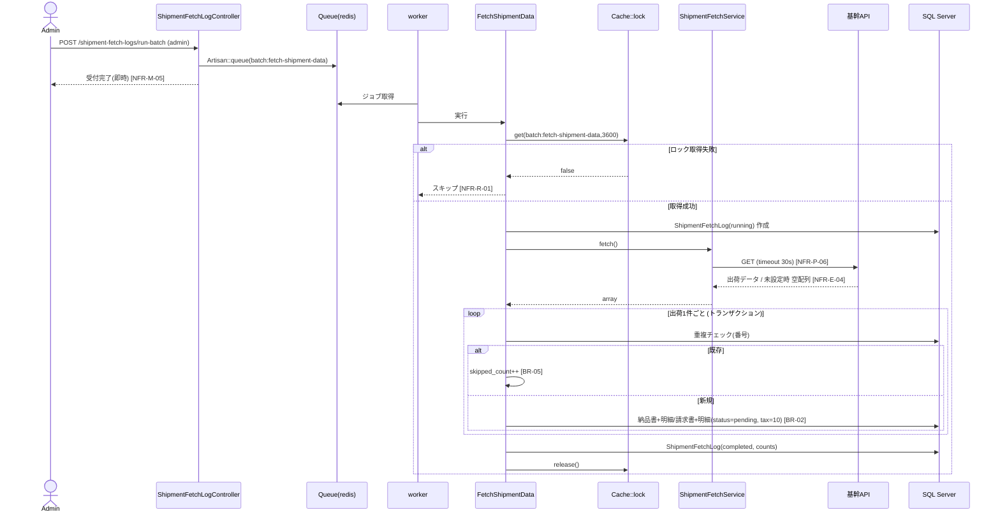
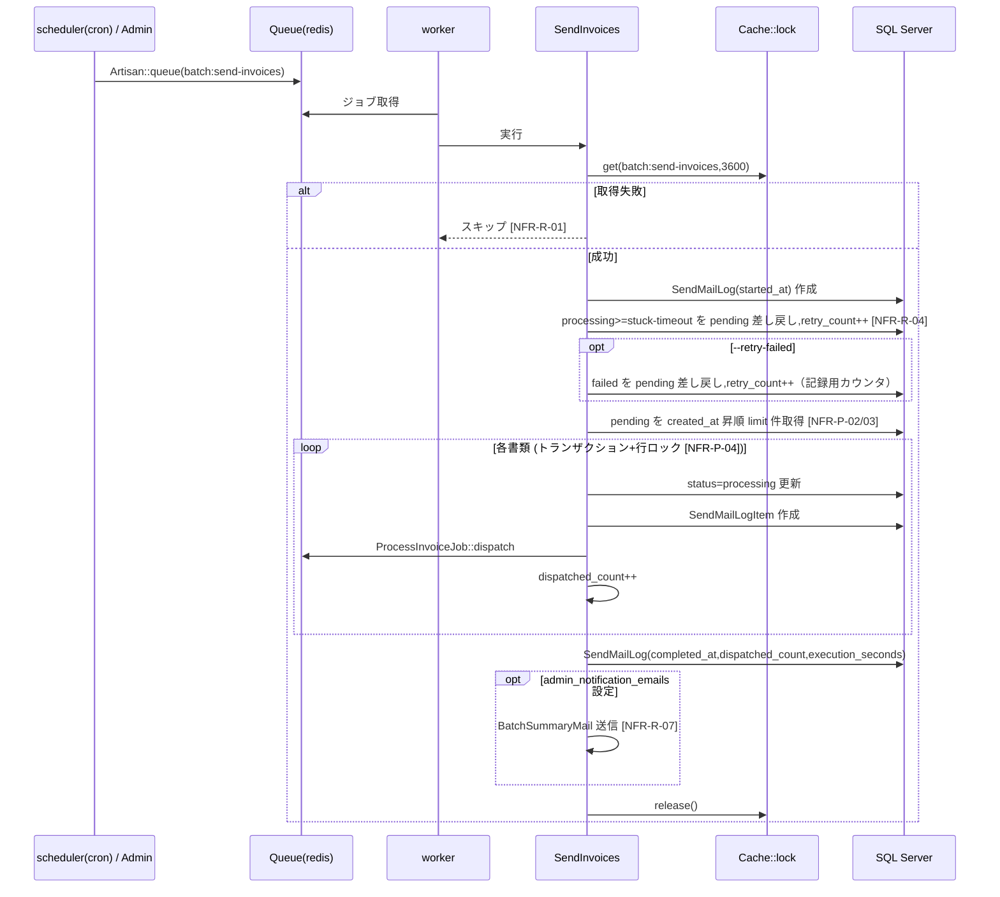
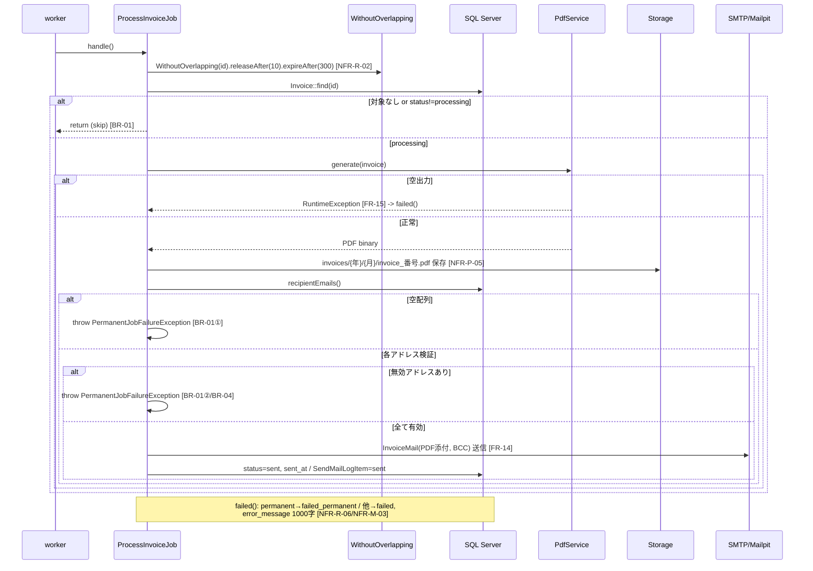
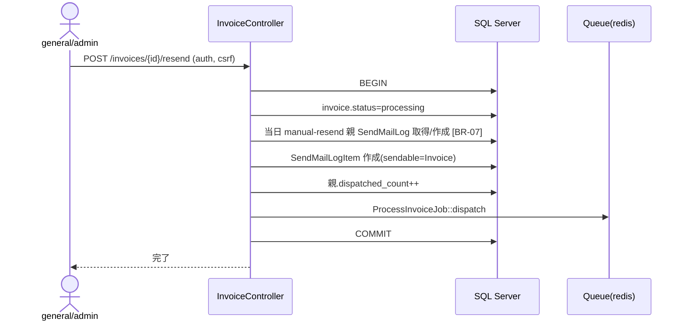
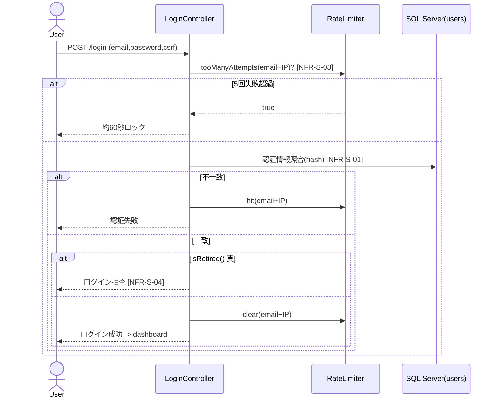
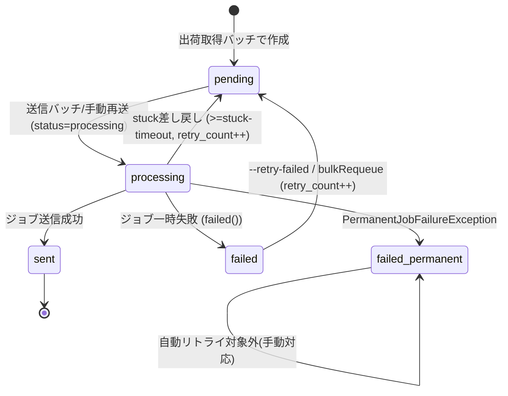
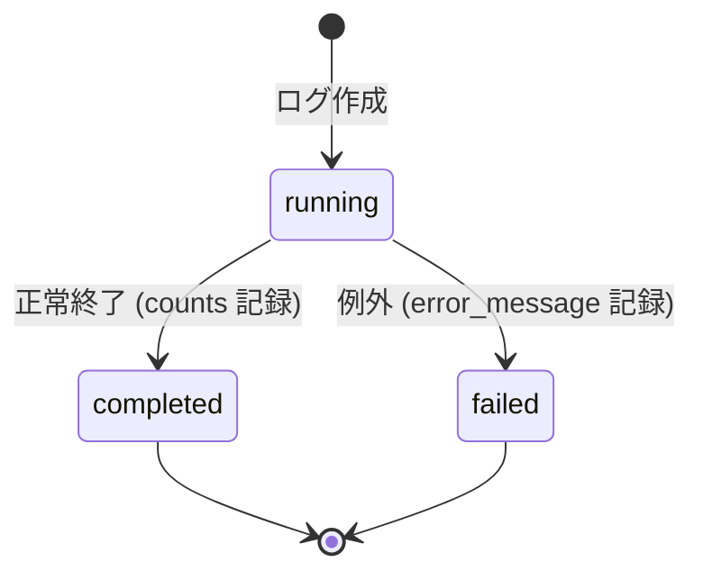
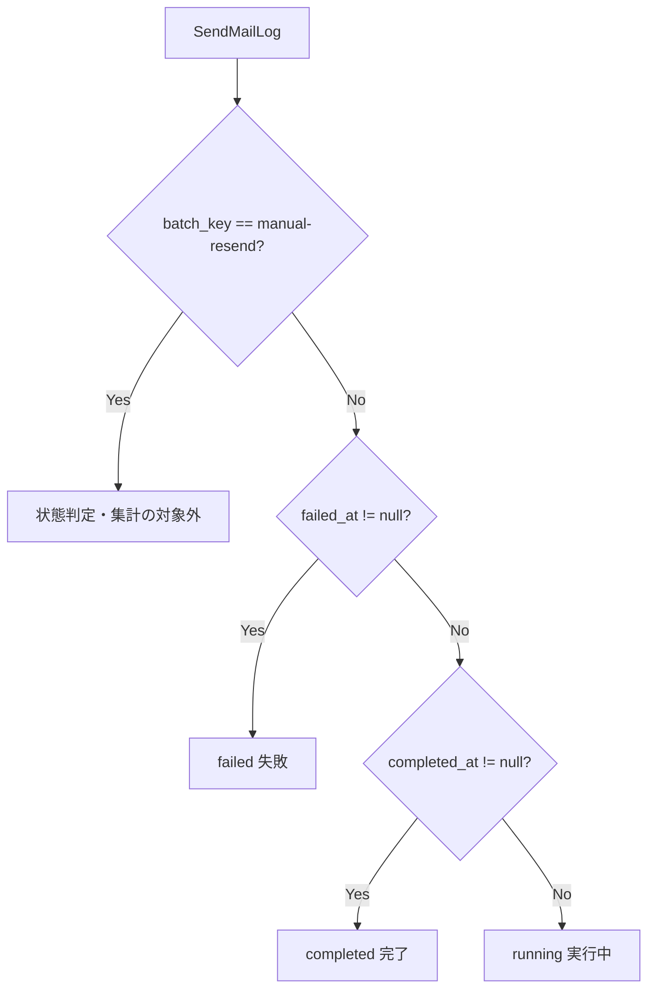

# 請求書メール配信システム 詳細設計書

> リバース元: `請求書メール配信システム仕様.md`（作成 2026-06-11 / 最終更新 2026-06-25）
> 入力: `design/basic-design.md` / `design/requirements.md`（FR-01〜17 / NFR / BR-01〜10 / OQ-01〜12）
> 作成日: 2026-06-29 / 作成: detailed-designer
> 性質: **実装済みシステムのリバース詳細設計**。新規仕様は追加せず、basic-design.md を実装検証可能なレベルへ具体化する。各詳細仕様は FR / NFR / BR と対応づける。
> 更新: 2026-07-01 — 全論点（OQ-01〜12・DB-Q-01/02）解消済み。決定内容を本文へ反映（詳細は10章・`design/questions.md`参照）。

---

## 0. 本書の読み方

- 各コンポーネントの「対応要件」列で FR / NFR / BR への写像を示す。これにより「実装がどの要件を満たすか」を仕様ベースで検証できる。
- 全論点（OQ-01〜12・DB-Q-01/02）は2026-07-01のヒアリングで解消済み。決定内容は本文へ反映済み（詳細は10章・`design/questions.md`参照）。
- メソッドシグネチャ・パラメータ名・定数値は仕様書からの観測値であり、実装検証時の照合基準として記す。

---

## 1. コンポーネント詳細仕様

### 1.1 Command 層（FR-01〜04 / NFR-R-01/04 / NFR-M-02/05）

3 コマンドはいずれも以下の共通骨格を持つ。差分は処理本体のみ。

```
共通骨格（送信系・取得系とも）:
  1. Cache::lock(<key>, 3600) を取得試行
       - get() が false ならログ出力して return（多重起動スキップ・NFR-R-01）
  2. 実行ログ作成（ShipmentFetchLog or SendMailLog）
  3. try { 業務処理 } catch (Throwable $e) { ログを failed/error_message 更新; rethrow しない }
  4. finally 相当で lock->release()
```

#### 1.1.1 FetchShipmentData（`batch:fetch-shipment-data`） — FR-01 / BR-02 / BR-05

| 項目 | 内容 | 対応要件 |
|------|------|---------|
| シグネチャ | `signature = "batch:fetch-shipment-data"` | FR-01 |
| オプション | なし（毎日12:15〜12:30にスケジュール自動実行。失敗時は手動起動で救済。2026-07-01決定） | FR-01 / FR-04 |
| ロックキー | `batch:fetch-shipment-data` / TTL 3600秒 | NFR-R-01 |

処理ステップ:

1. `Cache::lock('batch:fetch-shipment-data', 3600)->get()`。失敗時はスキップ（NFR-R-01）。
2. `ShipmentFetchLog` を `status=running`・`started_at=now()` で作成（NFR-M-02）。
3. `ShipmentFetchService::fetch()` を呼び出し出荷データ配列を取得（タイムアウト30秒・NFR-P-06）。未設定時は空配列（NFR-E-04）。
4. 取得件数を `fetched_count` に保持。出荷1件ごとに DB トランザクション内で:
   - `delivery_number` 既存チェック → 既存なら納品書作成スキップ・`skipped_count++`（BR-05）。
   - `invoice_number` 既存チェック → 既存なら請求書作成スキップ・`skipped_count++`（BR-05）。
   - 納品書 + `delivery_note_items` を `status=pending` で作成（`created_delivery_note_count++`）。
   - 請求書 + `invoice_items` を `status=pending` で作成（`created_invoice_count++`）。
   - 税額算出: `tax=10` 固定、`tax_amount = round(amount × tax / 100)`（BR-02）。
   - `customer_email` は出荷データから設定。空白のみの文字列はバリデーションエラーとして当該出荷データをスキップし、ログに記録する（2026-07-01決定）。
5. ログ更新（正常）: `status=completed`・`fetched_count`・`created_delivery_note_count`・`created_invoice_count`・`skipped_count`・`execution_seconds`・`completed_at`。
6. ログ更新（例外）: `catch(Throwable)` で `status=failed`・`error_message` を記録。
7. `lock->release()`。

例外処理: トランザクション単位は出荷1件ごと（1件の失敗が全体を巻き込むか個別 catch かは仕様未明示。失敗時はログ failed が観測仕様）。

#### 1.1.2 SendInvoices（`batch:send-invoices`） — FR-02 / NFR-R-04 / NFR-P-02/04

| 項目 | 内容 | 対応要件 |
|------|------|---------|
| シグネチャ | `batch:send-invoices {--limit=100} {--stuck-timeout=60} {--retry-failed}` | FR-02 |
| ロックキー | `batch:send-invoices` / TTL 3600秒 | NFR-R-01 |
| 対象 Model | Invoice / dispatch 先 ProcessInvoiceJob | FR-05 |

処理ステップ:

1. `Cache::lock('batch:send-invoices', 3600)->get()`。失敗時スキップ（NFR-R-01）。
2. `SendMailLog` を作成: `batch_key='send-invoices'`・`batch_name`（請求書 等）・`started_at=now()`。
3. **stuck 差し戻し（NFR-R-04）**: `status=processing` かつ `updated_at <= now()->subMinutes($stuckTimeout)` の Invoice を `status=pending` へ更新、各 `retry_count++`、件数を `reset_count` に計上。
4. **retry-failed（任意）**: `--retry-failed` 指定時、`status=failed` を `status=pending` へ更新、各 `retry_count++`（記録用カウンタ。ジョブ自動リトライとは非連動）、件数を `retry_failed_count` に計上。
5. **取得**: `status=pending` を `created_at` 昇順で最大 `--limit`（既定100）件取得（NFR-P-02 / 複合インデックス `(status, created_at)`・NFR-P-03）。
6. **各書類処理**: DB トランザクション + 行ロック（`lockForUpdate()`・NFR-P-04）で:
   - 再読込し `status=pending` を確認 → `status=processing` へ更新。
   - `SendMailLogItem` を作成（`send_mail_log_id`・ポリモーフィック `sendable=Invoice`・`status=pending/processing`）。
   - `ProcessInvoiceJob::dispatch($invoice->id, $sendMailLogItem->id)` を投入。`dispatched_count++`。
7. **完了ログ**: `completed_at=now()`・`dispatched_count`・`execution_seconds` を更新。
8. **通知**: `admin_notification_emails` 設定時 `BatchSummaryMail` 送信（NFR-R-07）。未設定時は警告ログのみ。
9. `lock->release()`。

#### 1.1.3 SendDeliveryNotes（`batch:send-delivery-notes`） — FR-03

SendInvoices と同一仕様。差分のみ:

| 項目 | 差分 |
|------|------|
| シグネチャ | `batch:send-delivery-notes {--limit=100} {--stuck-timeout=60} {--retry-failed}` |
| ロックキー | `batch:send-delivery-notes` |
| 対象 Model | DeliveryNote |
| batch_key | `send-delivery-notes` |
| dispatch | `ProcessDeliveryNoteJob` |

#### 1.1.4 スケジュール定義（Kernel / FR-04 / NFR-R-03）

| 時刻 | コマンド | 修飾 |
|------|---------|------|
| 毎日 01:00 | `batch:send-delivery-notes` | `withoutOverlapping()` + `runInBackground()` |
| 毎日 01:30 | `batch:send-invoices` | 同上 |
| 毎週月曜 02:00 | `batch:send-delivery-notes --retry-failed` | 同上 |
| 毎週月曜 02:30 | `batch:send-invoices --retry-failed` | 同上 |

`batch:fetch-shipment-data` は毎日12:15〜12:30に自動実行する（基幹の請求データ確定〈翌日12:00〉からのバッファを見た時刻。失敗時は手動起動で救済。2026-07-01決定）。

---

### 1.2 Job 層（FR-05 / FR-06 / NFR-R-02/05/06 / NFR-M-03/04）

#### 1.2.1 共通プロパティ・取得元

| プロパティ | 取得元 system_settings キー | フォールバック値 | 対応 |
|-----------|---------------------------|-----------------|------|
| `$maxExceptions` | `max_retries` | 3 | NFR-R-05 |
| `$backoff`（固定値） | `retry_backoff` | 30（シーダー値と統一・2026-07-01決定） | NFR-R-05 |
| `$timeout` | `pdf_timeout` | 60（シーダー値と統一・2026-07-01決定） | NFR-R-05 / FR-15 |

- 取得タイミング: **コンストラクタ**で `SystemSetting::get(key, fallback)` を呼び動的取得。これにより設定変更がワーカー再起動なしに次回ジョブ生成時へ反映される（NFR-M-04）。
- `$tries` は `$maxExceptions` と組み合わせ自動リトライ回数を制御（NFR-R-05）。

#### 1.2.2 ミドルウェア（NFR-R-02）

```php
middleware(): array {
    return [ (new WithoutOverlapping($this->id))->releaseAfter(10)->expireAfter(300) ];
}
```
- 同一書類 ID の並行実行防止。`releaseAfter(10)` はロック取得失敗時の再試行遅延であり多重実行防止とは無関係。実際のロック保持期間は `expireAfter` で決まるため、`pdf_timeout` の最大値（300秒）以上を明示指定し、処理完了前にロックが失効して多重実行が発生することを防ぐ（2026-07-01決定）。

#### 1.2.3 handle() 詳細フロー（ProcessInvoiceJob・FR-05）

```
handle():
  1. $invoice = Invoice::find($this->id)
       - null → Log::info(対象なし) して return（NFR-M-02）
  2. if ($invoice->status !== 'processing') → return（status ガード・BR-01）
  3. $pdf = PdfService::generate($invoice)
       - 空出力なら PdfService が RuntimeException（FR-15）→ failed 分岐へ
  4. Storage::put("invoices/{年}/{月}/invoice_{invoice_number}.pdf", $pdf)（NFR-P-05）
  5. $emails = $invoice->recipientEmails()
       - empty($emails) → throw PermanentJobFailureException（BR-01①）
  6. foreach ($emails as $e):
       if (filter_var($e, FILTER_VALIDATE_EMAIL) === false)
           → throw PermanentJobFailureException（BR-01② / BR-04）
  7. Mail::to($emails)->send(new InvoiceMail($invoice, $pdfPath))（FR-14）
  8. 成功: $invoice->update(status='sent', sent_at=now())
           SendMailLogItem->update(status='sent', sent_at=now())（NFR-M-02）
```

- 保存先パス: 請求書 `invoices/{年}/{月}/invoice_{invoice_number}.pdf`。年月の基準日は `issue_date` 想定。
- 納品書（ProcessDeliveryNoteJob）の年月基準日は `delivery_date`（納品・出荷日）で確定（2026-07-01決定・Q-11）。

#### 1.2.4 failed() 詳細フロー（NFR-R-06 / NFR-M-03）

```
failed(Throwable $e):
  1. $isPermanent = ($e instanceof PermanentJobFailureException)
  2. $status = $isPermanent ? 'failed_permanent' : 'failed'
  3. $document->update(status=$status)            （BR-01）
  4. SendMailLogItem->update(
        status = $status,
        error_message = mb_substr($e->getMessage(), 0, 1000)  （NFR-M-03）
     )
```

- `failed_permanent` は自動リトライ対象外（送付先0件・無効アドレス）。手動対応に委ねる（NFR-R-06）。
- それ以外（PDF生成失敗・SMTP一時障害など）は `failed`。`--retry-failed` または `bulkRequeue` で `pending` へ戻して再試行可能（BR-01）。

#### 1.2.5 ProcessDeliveryNoteJob（FR-06）

ProcessInvoiceJob と同一フロー。差分: 対象 DeliveryNote、保存先 `delivery-notes/{年}/{月}/delivery_{delivery_number}.pdf`（年月基準日は `delivery_date` で確定・2026-07-01決定・Q-11）、メール `DeliveryNoteMail`。

---

### 1.3 Service 層

#### 1.3.1 ShipmentFetchService（FR-01 / NFR-P-06 / NFR-E-04）

| メソッド | シグネチャ | 内容 | 例外 |
|---------|-----------|------|------|
| `fetch` | `fetch(): array` | `config('services.backbone.url')`（=`BACKBONE_API_URL`）へ Laravel HTTP Client で接続（`timeout(30)`）。レスポンスを出荷データ配列へ整形して返す | HTTP/接続例外は Command 側で catch しログ failed |

内部処理:
1. `$url = config('services.backbone.url')`。
2. `if (empty($url)) return [];`（ダミー・空配列・NFR-E-04）。
3. `Http::timeout(30)->get($url)`（想定 GET/POST・NFR-P-06）。
4. レスポンス JSON を配列化（データ契約: §2.4）。

#### 1.3.2 PdfService（FR-15 / NFR-S-08 / NFR-P-05）

| メソッド | シグネチャ | 内容 | 例外 |
|---------|-----------|------|------|
| `generate` | `generate(Model $document): string` | Blade ビューを DomPDF へ流し A4縦 PDF バイナリを返す | 出力空なら `RuntimeException`（FR-15） |

内部処理:
1. `LoadDompdfFonts`（日本語フォント事前読込）。
2. DomPDF オプション: `setPaper('a4', 'portrait')`、`isRemoteEnabled=false`（リモートリソース無効化）、`chroot=storage パス`（ローカル参照制限・NFR-S-08）。
3. `$output = $pdf->output();`
4. `if ($output === '' ) throw new RuntimeException(...)`（FR-15）。
5. 返却（保存は呼び出し側責務。バッチ時は保存・即時 DL 時は非保存・NFR-P-05）。

---

### 1.4 Controller 層（FR-07〜13 / FR-16 / FR-17 / NFR-S-06）

入力検証はすべて allowlist（NFR-S-06）。権限は §3 ルート表の middleware による。

#### 1.4.1 DashboardController — FR-07

| メソッド | 入力 | 処理 | 権限 |
|---------|------|------|------|
| `index` | なし | Invoice / DeliveryNote の status 別件数集計、SendMailLog 直近実行・全体集計（`displayStatus()` で判定・`failed_at` 優先・manual-resend 除外）、ShipmentFetchLog 直近、各送信バッチ最終実行情報を表示 | auth |

#### 1.4.2 InvoiceController — FR-08 / FR-15

| メソッド | メソッド/検証ルール | 処理 | 権限 |
|---------|--------------------|------|------|
| `index` | GET / `status` allowlist（pending/processing/sent/failed/failed_permanent） | 20件/ページ・status 別サマリー（NFR-P-01） | auth |
| `show` | GET | 明細 + 全 SendMailLogItem 履歴表示 | auth |
| `resend` | POST | §1.4.7 手動再送フロー | auth |
| `updateEmails` | POST / `emails` 配列 1〜3件・各 `nullable email`・未入力 null 正規化。対象は `failed`/`failed_permanent` のみ（BR-04） | customer_email 系を更新 | admin（誤送信リスクのため admin 限定に変更・2026-07-01決定） |
| `bulkRequeue` | POST / 対象 id 配列 | `failed`→`pending` 一括・`retry_count++`。`retry_count>=3` を含む場合は確認ダイアログ表示。`retry_count>=10` は対象外とし `failed` のまま残す（2026-07-01決定） | admin |
| `runBatch` | POST | `Artisan::queue('batch:send-invoices')`（非同期受付・NFR-M-05） | admin |
| `downloadPdf` | GET | Storage にあれば返却、なければ PdfService 即時生成（非保存・NFR-P-05 / FR-15） | auth |
| `downloadCsv` | GET / `status` allowlist | UTF-8 BOM 付き CSV・複数送付先 ` / ` 区切り（UTF-8 BOM付きで確定・2026-07-01決定・Q-10） | auth |

#### 1.4.3 DeliveryNoteController — FR-09

InvoiceController と同一（Invoice→DeliveryNote 読替・dispatch は ProcessDeliveryNoteJob・runBatch は `batch:send-delivery-notes`）。

#### 1.4.4 SendMailLogController — FR-10

| メソッド | 検証 | 処理 | 権限 |
|---------|------|------|------|
| `index` | GET / `filter` allowlist（completed/running/manual_resend/has_pending/has_sent/has_failure/has_failure_permanent/failed） | 20件/ページ（NFR-P-01） | auth |
| `show` | GET | 書類1通ごとの明細 50件/ページ（NFR-P-01） | auth |
| `complete`（廃止） | ~~POST~~ | 手動完了機能は2026-07-01決定により廃止。ログは保持するがダッシュボードのサマリー・一覧の両方から除外し、別画面でのみ確認可能とする（BR-07） | - |

#### 1.4.5 ShipmentFetchLogController — FR-11

| メソッド | 検証 | 処理 | 権限 |
|---------|------|------|------|
| `index` | GET / `status` allowlist（running/completed/failed） | ページネーション表示 | auth |
| `runBatch` | POST | `Artisan::queue('batch:fetch-shipment-data')`（非同期・NFR-M-05） | admin |

#### 1.4.6 UserController — FR-12 / BR-08

| メソッド | 検証ルール | 処理 | 権限 |
|---------|-----------|------|------|
| `index` | GET / `role` allowlist・`include_retired` | 20件/ページ・退職者は既定除外（`isRetired()`） | admin |
| `store` | POST / `name` required・`email` required unique・`password` min:8 confirmed・`role` in:general,admin（NFR-S-01） | 作成（password ハッシュ） | admin |
| `update` | PUT / store と同項目。`password` 入力時のみ更新。`retired` チェックで `retired_at` set/解除 | 更新 | admin |
| `destroy` | DELETE | 物理削除。自分自身は削除不可（BR-08） | admin |

#### 1.4.7 SystemSettingController — FR-13

| メソッド | 検証ルール | 処理 | 権限 |
|---------|-----------|------|------|
| `index` | GET | 設定一覧表示 | admin |
| `update` | POST / integer 型は `min_value`〜`max_value` 範囲、emails 型は `FILTER_VALIDATE_EMAIL` で1行1アドレス検証 | system_settings 更新（改行区切り保存） | admin |
| `sendTestMail` | POST / `email` required email | `TestMail` 送信 | admin |

設定キー検証域（FR-13 / BR-06）:

| キー | 型 | 既定値（シーダー） | 範囲 |
|------|-----|------|------|
| `pdf_timeout` | integer | 60 | 10〜300 |
| `retry_backoff` | integer | 30 | 0〜3600 |
| `max_retries` | integer | 3 | 0〜10 |
| `admin_notification_emails` | emails | 管理者宛 | - |
| `mail_bcc_address` | emails | 空 | - |

#### 1.4.8 LoginController — FR-16 / NFR-S

| メソッド | 検証 | 処理 | 権限 |
|---------|------|------|------|
| `showLoginForm` | GET | ログイン画面 | guest |
| `login` | POST / `email` required email・`password` required | ①RateLimiter（メール+IP・5回・約60秒・NFR-S-03）②認証 ③`isRetired()` 真ならログイン拒否（NFR-S-04）④成功でカウンタリセット | guest |
| `logout` | POST | セッション破棄 | auth |

#### 1.4.7（再送フロー）resend 詳細（FR-08 / BR-07）

```
resend(Invoice $invoice):
  1. DB トランザクション開始
  2. $invoice->update(status='processing')
  3. 当日分 manual-resend 親 SendMailLog を取得 or 作成
       （batch_key='manual-resend'・当日1件に集約・BR-07）
  4. SendMailLogItem 作成（sendable=Invoice・status=processing）
  5. 親 SendMailLog の dispatched_count++
  6. ProcessInvoiceJob::dispatch(...)
  7. コミット
```

---

### 1.5 Mail 層（FR-14）

| Mailable | 件名 | ビュー（想定） | 添付 | envelope BCC | 発火元 |
|----------|------|--------------|------|--------------|--------|
| InvoiceMail | `【請求書】{invoice_number}` | `emails.invoice` | 請求書 PDF | `SystemSetting::mailBccAddresses()` | ProcessInvoiceJob |
| DeliveryNoteMail | `【納品書】{delivery_number}` | `emails.delivery_note` | 納品書 PDF | 同上 | ProcessDeliveryNoteJob |
| BatchSummaryMail | `【バッチ完了】{batch_name}メール送信 {実行開始日時} 実行分` | `emails.batch_summary` | なし | 同上 | 送信 Command |
| TestMail | `【テスト】メール送信テスト` | `emails.test` | なし | 同上 | SystemSettingController |

- BCC 共通実装: `envelope()` で `bcc: SystemSetting::mailBccAddresses()` を付与。未設定時は空配列で BCC なし（FR-14）。
- 添付: 請求書/納品書は `attach()` で PDF を添付（Storage パスまたは生成済みバイナリ）。

---

## 1A. 画面（UI）詳細仕様（FA-01・2026-07-07 追加）

> 出典: `basic-design.md` §5A「画面デザイン方針」（Tailwind 標準ユーティリティのみ・
> 追加コンポーネントライブラリ不使用・サイドナビ+ヘッダー構成）を実装検証可能なレベルへ
> 具体化する。UI 仕様のみを定義し、業務ロジック・API 定義（§2）・シーケンス（§3）・
> Model（§4）・状態遷移（§5）は変更しない。Tailwind クラスは代表的な用途を示す指針で
> あり、実装での厳密なクラス名は本節と整合していれば可とする。

### 1A.1 共通レイアウト（`layouts/app` 想定）

ログイン画面を除く全管理画面が継承する共通 Blade レイアウト。ナビ項目・ヘッダーの
変更が全画面へ一括反映される（NFR-M）。

**構造**: `flex min-h-screen` の 2 カラム。左に固定サイドナビ、右にヘッダー + メイン。

| 領域 | 内容 | Tailwind 使用方針（代表） |
|------|------|--------------------------|
| サイドナビ（左固定） | アプリ名/ロゴ（上部）+ ナビリンク群 | `w-64 shrink-0 bg-slate-800 text-slate-100 min-h-screen` / リンク `block px-4 py-2 rounded hover:bg-slate-700`、現在ページは `bg-slate-900 font-semibold`（active 強調） |
| ヘッダー（上部） | 画面タイトル（左）、ログインユーザー名・ロールバッジ・ログアウトボタン（右） | `flex items-center justify-between h-14 px-6 bg-white border-b` / ロールバッジ `text-xs px-2 py-0.5 rounded-full`（admin=`bg-indigo-100 text-indigo-700` / general=`bg-gray-100 text-gray-600`）/ ログアウトは `@csrf` 付き POST フォームのボタン |
| メインコンテンツ | 各画面固有の一覧・詳細・フォーム。フラッシュメッセージ領域を最上部に配置 | `flex-1 bg-gray-50 p-6` / フラッシュ success=`bg-green-50 text-green-800 border border-green-200`、error=`bg-red-50 text-red-800 border border-red-200`、共通 `rounded p-3 mb-4` |

**サイドナビ項目構成**（basic-design §5A.2 と整合。表示順）:

| 項目 | 遷移先ルート | 表示条件 |
|------|-------------|---------|
| ダッシュボード | `dashboard` | auth（全員） |
| 請求書 | `invoices.index` | auth（全員） |
| 納品書 | `delivery-notes.index` | auth（全員） |
| メール送信履歴 | `send-mail-logs.index` | auth（全員） |
| 出荷取得履歴 | `shipment-fetch-logs.index` | auth（全員） |
| ユーザー管理 | `users.index` | `isAdmin()` 時のみ表示（FR-17） |
| システム設定 | `system-settings.index` | `isAdmin()` 時のみ表示（FR-13/FR-17） |

- admin 専用リンクの非表示はあくまで UI 補助であり、保護の本体は `auth` / `admin`
  ミドルウェア（§2.1 / §7）。ロールに関わらずルート保護は維持される。

**共通 UI 部品の Tailwind 方針**（各画面で再利用）:

| 部品 | 用途 | 代表クラス |
|------|------|-----------|
| 状態バッジ | 書類/ログの status 表示 | `inline-block text-xs px-2 py-0.5 rounded-full`。pending=`bg-gray-100 text-gray-700` / processing=`bg-blue-100 text-blue-700` / sent・completed=`bg-green-100 text-green-700` / failed=`bg-red-100 text-red-700` / failed_permanent=`bg-red-200 text-red-900` / running=`bg-yellow-100 text-yellow-700` |
| 一次ボタン | 送信・保存・実行 | `bg-indigo-600 hover:bg-indigo-700 text-white px-4 py-2 rounded` |
| 副次ボタン | キャンセル・戻る | `bg-white border border-gray-300 hover:bg-gray-50 px-4 py-2 rounded` |
| 危険ボタン | 削除 | `bg-red-600 hover:bg-red-700 text-white px-4 py-2 rounded` |
| テーブル | 一覧共通 | `min-w-full divide-y divide-gray-200` / thead `bg-gray-50 text-left text-xs font-medium text-gray-500 uppercase` / 行 `hover:bg-gray-50` / セル `px-4 py-3 text-sm` |
| カード | 詳細・フォーム枠 | `bg-white shadow-sm rounded-lg border border-gray-200 p-6` |
| フォーム入力 | input/select/textarea | `border border-gray-300 rounded px-3 py-2 w-full focus:ring-indigo-500 focus:border-indigo-500` / ラベル `block text-sm font-medium text-gray-700 mb-1` / エラー `text-sm text-red-600 mt-1` |
| ページネーション | 一覧下部 | Laravel Paginator の Tailwind ビュー（`links()`）を使用 |

### 1A.2 ログイン画面（FR-16）

- **レイアウト**: 共通レイアウト **非継承**の単独ページ。サイドナビ・ヘッダーなし。
- **構成**: 画面中央寄せ（`min-h-screen flex items-center justify-center bg-gray-50`）の
  カード（`w-full max-w-sm bg-white shadow rounded-lg p-8`）内に、アプリ名見出し、
  メール入力、パスワード入力、ログインボタン（一次ボタン・`w-full`）を縦積み。
- **要素**: `@csrf`、`email`（`type=email`）、`password`（`type=password`）、
  バリデーション/認証エラー・試行制限メッセージをフォーム上部にエラースタイルで表示。

### 1A.3 ダッシュボード（FR-07）

- **構成**: 集計サマリーの**カードグリッド**（`grid grid-cols-1 md:grid-cols-3 gap-4`）。
- **カード内容**: 請求書・納品書の status 別件数（数値を大きく `text-2xl font-bold`、
  ラベルを `text-sm text-gray-500`、status バッジ併記）、直近の送信バッチ実行情報
  （`displayStatus()` 判定・manual-resend 除外）、直近の出荷取得実行情報。
- 各カードから対応する一覧画面へのリンク（副次ボタンまたはカード全体をリンク化）。

### 1A.4 請求書 一覧・詳細（FR-08 / FR-15）／ 1A.5 納品書 一覧・詳細（FR-09）

納品書は請求書と同一構成（Invoice→DeliveryNote 読替）。

**一覧（index）**:
- ページ上部に status 別サマリー（バッジ + 件数の横並び）とフィルタ（`status` の
  select・allowlist）、CSV ダウンロードボタン（副次ボタン）、admin には一括再送
  （bulkRequeue）・バッチ実行（runBatch）ボタンを配置。
- 本体は**テーブル**（番号・宛先・金額・status バッジ・作成日時・操作リンク）。
  1 ページ 20 件（NFR-P-01）。下部にページネーション。
- 操作列: 詳細リンク、PDF ダウンロード。bulkRequeue はチェックボックス選択 +
  一括操作ボタン（`retry_count>=3` を含む場合は JS confirm ダイアログ）。

**詳細（show）**:
- 上部に書類ヘッダー**カード**（番号・宛先・金額・税額・status バッジ・各日付）。
- 明細を**テーブル**で表示（品目・数量・単価・金額）。
- 送信履歴（SendMailLogItem 一覧）を**テーブル**で表示（status バッジ・送信日時・
  エラーメッセージ）。
- 操作カード: 再送（resend・一次ボタン + confirm）、PDF ダウンロード（副次）、
  admin にはメールアドレス編集（updateEmails・`failed`/`failed_permanent` のみ活性）を
  フォームで配置（メール入力 1〜3 件）。

### 1A.6 メール送信履歴 一覧・詳細（FR-10）

**一覧（index）**:
- フィルタ（`filter` の select・allowlist: completed/running/manual_resend/has_pending
  /has_sent/has_failure/has_failure_permanent/failed）。
- **テーブル**（バッチ名・displayStatus バッジ・開始/完了日時・dispatched_count 等の
  カウント・詳細リンク）。20 件/ページ（NFR-P-01）。

**詳細（show）**:
- 上部にバッチ実行情報**カード**（batch_name・displayStatus・各日時・件数）。
- 書類 1 通ごとの明細（SendMailLogItem）を**テーブル**表示。50 件/ページ（NFR-P-01）。
  status バッジ・宛先書類へのリンク・エラーメッセージ。
- 「送信済みにする」ボタンは §5.4 の条件で表示（complete 機能は廃止済みのため、
  実質ボタンは表示されない／別画面確認）。

### 1A.7 出荷取得履歴（FR-11）

- フィルタ（`status` の select・allowlist: running/completed/failed）と、admin には
  バッチ手動起動ボタン（runBatch・一次ボタン + confirm）を上部に配置。
- **テーブル**（status バッジ・開始/完了日時・fetched_count・作成件数・skipped_count・
  execution_seconds・error_message）。ページネーション。

### 1A.8 ユーザー管理（admin・FR-12）

- 上部に新規作成ボタン（一次ボタン）、退職者表示切替（`include_retired` チェック/リンク）。
- **テーブル**（名前・メール・role バッジ・退職状態・操作）。20 件/ページ・退職者は
  既定除外。
- 作成/編集は**標準フォーム**（モーダルまたは別カード）: name・email・password
  （+confirmation）・role（select: general/admin）・retired（編集時チェック）。
  バリデーションエラーは各項目下にエラースタイルで表示。
- 削除は危険ボタン + confirm。自分自身の削除ボタンは非表示/非活性（BR-08）。

### 1A.9 システム設定（admin・FR-13）

- 設定項目を**標準フォーム**（カード内）で表示・編集。integer 型は数値入力
  （`min`/`max` 属性を `min_value`/`max_value` に対応）、emails 型は textarea
  （1 行 1 アドレス）。各項目にラベル・説明・範囲を併記。
- 保存ボタン（一次ボタン）。別カードにテストメール送信フォーム（email 入力 +
  送信ボタン・sendTestMail）。

---

## 2. API 定義（内部）

### 2.1 ルート一覧（web.php）

| メソッド | パス | コントローラ#メソッド | ルート名 | 認証 |
|---------|------|---------------------|---------|------|
| GET | `/login` | LoginController#showLoginForm | login | guest |
| POST | `/login` | LoginController#login | login.post | guest |
| POST | `/logout` | LoginController#logout | logout | auth |
| GET | `/` | DashboardController#index | dashboard | auth |
| GET | `/invoices` | InvoiceController#index | invoices.index | auth |
| GET | `/invoices/{invoice}` | InvoiceController#show | invoices.show | auth |
| POST | `/invoices/{invoice}/resend` | InvoiceController#resend | invoices.resend | auth |
| POST | `/invoices/{invoice}/emails` | InvoiceController#updateEmails | invoices.emails | auth+admin（2026-07-01決定） |
| POST | `/invoices/bulk-requeue` | InvoiceController#bulkRequeue | invoices.bulkRequeue | auth+admin |
| POST | `/invoices/run-batch` | InvoiceController#runBatch | invoices.runBatch | auth+admin |
| GET | `/invoices/{invoice}/pdf` | InvoiceController#downloadPdf | invoices.pdf | auth |
| GET | `/invoices/csv` | InvoiceController#downloadCsv | invoices.csv | auth |
| GET | `/delivery-notes` | DeliveryNoteController#index | delivery-notes.index | auth |
| GET | `/delivery-notes/{deliveryNote}` | DeliveryNoteController#show | delivery-notes.show | auth |
| POST | `/delivery-notes/{deliveryNote}/resend` | DeliveryNoteController#resend | delivery-notes.resend | auth |
| POST | `/delivery-notes/{deliveryNote}/emails` | DeliveryNoteController#updateEmails | delivery-notes.emails | auth+admin（2026-07-01決定） |
| POST | `/delivery-notes/bulk-requeue` | DeliveryNoteController#bulkRequeue | delivery-notes.bulkRequeue | auth+admin |
| POST | `/delivery-notes/run-batch` | DeliveryNoteController#runBatch | delivery-notes.runBatch | auth+admin |
| GET | `/delivery-notes/{deliveryNote}/pdf` | DeliveryNoteController#downloadPdf | delivery-notes.pdf | auth |
| GET | `/delivery-notes/csv` | DeliveryNoteController#downloadCsv | delivery-notes.csv | auth |
| GET | `/send-mail-logs` | SendMailLogController#index | send-mail-logs.index | auth |
| GET | `/send-mail-logs/{log}` | SendMailLogController#show | send-mail-logs.show | auth |
| ~~POST~~（廃止） | ~~/send-mail-logs/{log}/complete~~ | ~~SendMailLogController#complete~~ | - | 2026-07-01決定によりルート自体を削除 |
| GET | `/shipment-fetch-logs` | ShipmentFetchLogController#index | shipment-fetch-logs.index | auth |
| POST | `/shipment-fetch-logs/run-batch` | ShipmentFetchLogController#runBatch | shipment-fetch-logs.runBatch | auth+admin |
| GET | `/users` | UserController#index | users.index | auth+admin |
| POST | `/users` | UserController#store | users.store | auth+admin |
| PUT | `/users/{user}` | UserController#update | users.update | auth+admin |
| DELETE | `/users/{user}` | UserController#destroy | users.destroy | auth+admin |
| GET | `/system-settings` | SystemSettingController#index | system-settings.index | auth+admin |
| POST | `/system-settings` | SystemSettingController#update | system-settings.update | auth+admin |
| POST | `/system-settings/test-mail` | SystemSettingController#sendTestMail | system-settings.testMail | auth+admin |

- 全 POST/PUT/DELETE は `@csrf`（VerifyCsrfToken）で保護（FR-17 / NFR-S-05）。
- パスはリバース上の代表表現であり、実装のパス命名と照合して検証する。

### 2.2 各 POST の入力パラメータ

| ルート | パラメータ | 検証ルール |
|--------|-----------|-----------|
| login.post | `email` / `password` | email: required\|email、password: required |
| invoices.emails | `emails[]`（最大3） | 各 nullable\|email、未入力は null 正規化、対象 status は failed/failed_permanent のみ |
| invoices.bulkRequeue | `ids[]` | 各 exists:invoices,id、対象は failed のみ処理 |
| invoices.runBatch | （なし） | admin 権限のみ |
| ~~send-mail-logs.complete~~（廃止） | - | 2026-07-01決定により機能自体を廃止 |
| users.store | `name` / `email` / `password` / `password_confirmation` / `role` | name: required、email: required\|email\|unique、password: required\|min:8\|confirmed、role: required\|in:general,admin |
| users.update | 同上 + `retired` | password: nullable\|min:8\|confirmed（入力時のみ）、retired: boolean |
| system-settings.update | 各設定キー値 | integer 型は min_value〜max_value、emails 型は1行1アドレス FILTER_VALIDATE_EMAIL |
| system-settings.testMail | `email` | required\|email |

### 2.3 基幹システム API 連携の入出力データ契約（ShipmentFetchService）

- 方式: Laravel HTTP Client（REST・想定 GET/POST）、`BACKBONE_API_URL`、タイムアウト30秒（NFR-P-06）。
- 未設定時: 空配列を返却（NFR-E-04）。

**入力（リクエスト）**: 仕様書に明示なし（取得対象期間等のパラメータは未確定。リバース範囲外）。

**出力（レスポンス・出荷データ1件の論理項目）**:

| 項目 | 用途 | 備考 |
|------|------|------|
| `delivery_number` | 納品書番号（重複スキップキー） | BR-05 |
| `invoice_number` | 請求書番号（重複スキップキー） | BR-05 |
| `amount` | 金額（税抜） | tax_amount 算出元・BR-02 |
| `customer_email`（系・最大3件） | 送付先 | 空白のみの文字列は出荷取得バッチでバリデーションしスキップ（2026-07-01決定） |
| 明細項目群 | invoice_items / delivery_note_items 化 | BR-09 |
| 日付項目（issue_date / delivery_date 等） | PDF パス年月・帳票表示 | 納品書の年月基準日は `delivery_date` で確定（2026-07-01決定・Q-11） |

### 2.4 出力データ契約の Command 側処理

- `tax=10`、`tax_amount=round(amount*tax/100)` を Command で付与（API は税額を返さない前提・BR-02）。
- `status=pending` を Command で付与（API には存在しない内部状態）。

---

## 3. シーケンス図（Mermaid）

### 3.1 出荷取得バッチ（FR-01）



### 3.2 送信バッチ → キュージョブ投入（FR-02/03/04）



### 3.3 キュージョブ実行（FR-05/06）



### 3.4 手動再送（FR-08 / BR-07）



### 3.5 ログイン（FR-16 / NFR-S）



---

## 4. Model 層詳細仕様（BR-01〜09）

### 4.1 Invoice / DeliveryNote（BR-01 / BR-04 / NFR-P-03）

**ステータス定数**:
```
STATUS_PENDING          = 'pending'
STATUS_PROCESSING       = 'processing'
STATUS_SENT             = 'sent'
STATUS_FAILED           = 'failed'
STATUS_FAILED_PERMANENT = 'failed_permanent'
```

**メソッド**:

| メンバ | 種別 | 仕様 | 対応 |
|--------|------|------|------|
| `recipientEmails()` | メソッド | customer_email 系（最大3件）を trim・空文字除去して配列で返す | BR-04 |
| `items()` | リレーション | hasMany(invoice_items / delivery_note_items)・親 FK cascade | BR-09 |
| `sendMailLogItems()` | リレーション | morphMany(SendMailLogItem, 'sendable') | NFR-E-02 |
| スコープ `status` フィルタ | scope | allowlist フィルタ用 | NFR-S-06 / FR-08 |

**インデックス**: 複合 `(status, created_at)` + `status` 単独（NFR-P-03）。

### 4.2 invoice_items / delivery_note_items（BR-09）

- 親（invoices / delivery_notes）への FK は cascade delete。
- 明細項目（品目・数量・単価・金額等）。`belongsTo` で親へ。

### 4.3 SendMailLog（BR-03 / BR-07）

**主なカラム**: `batch_key`・`batch_name`・`started_at`・`completed_at`・`failed_at`・`dispatched_count`・`reset_count`・`retry_failed_count`・`execution_seconds`・`error_message`。

**`displayStatus()` 判定ロジック（BR-03・§5 状態遷移詳細参照）**:
```
if (failed_at != null)        return 'failed';      // 最優先
if (completed_at != null)     return 'completed';
return 'running';                                    // 両方 null
// batch_key='manual-resend' は状態判定・集計の対象外
```

**スコープ / メソッド**:

| メンバ | 仕様 |
|--------|------|
| `items()` | hasMany(SendMailLogItem) |
| `manualResendBucket()`（スタティック想定） | 当日分 `batch_key='manual-resend'` の親を取得 or 作成（BR-07） |
| フィルタスコープ | index の filter allowlist（completed/running/manual_resend/has_pending/has_sent/has_failure/has_failure_permanent/failed）に対応 |

### 4.4 SendMailLogItem（BR-09 / NFR-E-02 / NFR-M-03）

- ポリモーフィック: `sendable`（Invoice / DeliveryNote）。
- `send_mail_log_id` は **restrictOnDelete**（削除機能が存在・計画もないため親レコード削除不可。2026-07-01決定）。
- カラム: `status`（pending/processing/sent/failed/failed_permanent）・`error_message`（1000字まで・NFR-M-03）・`sent_at`。

### 4.5 ShipmentFetchLog（BR-01 / BR-09）

**ステータス**: `running` → `completed` / `failed`。
- 書類との直接リレーションを持たない（実行ログのみ・BR-09）。
- カラム: `status`・`started_at`・`completed_at`・`fetched_count`・`created_delivery_note_count`・`created_invoice_count`・`skipped_count`・`execution_seconds`・`error_message`。

### 4.6 SystemSetting（FR-13 / BR-06 / NFR-E-01）

KVS（key / value / type / min_value / max_value）。

| メソッド | シグネチャ | 仕様 |
|---------|-----------|------|
| `get` | `get(string $key, $default = null)` | 値を返す。未登録時 `$default`（= ジョブのフォールバック値。シーダー既定値と統一済み・2026-07-01決定） |
| `mailBccAddresses` | `mailBccAddresses(): array` | `mail_bcc_address` を改行分割・trim・空除去で配列化。未設定時 空配列 |
| （integer 検証） | - | `min_value`〜`max_value` で範囲検証（BR-06） |
| （emails 検証） | - | FILTER_VALIDATE_EMAIL で1行1アドレス検証・改行区切り保存 |

### 4.7 User（FR-12 / FR-16 / BR-08）

**カラム**: `name`・`email`(unique)・`password`(hash)・`role`(general/admin)・`retired_at`。

| メソッド | 仕様 |
|---------|------|
| `isAdmin()` | `role === 'admin'` を返す（admin Middleware 判定で使用・FR-17） |
| `isRetired()` | `retired_at !== null` を返す（ログイン拒否判定・FR-16 / NFR-S-04） |
| スコープ（退職者除外） | 既定で `retired_at IS NULL`。`include_retired` で解除（FR-12） |
| スコープ `role` フィルタ | allowlist（NFR-S-06） |

---

## 5. 状態遷移の詳細

### 5.1 書類ステータス遷移（BR-01）



**failed_permanent 遷移条件（BR-01）**:
1. `recipientEmails()` が空（送付先0件）。
2. いずれかのアドレスが `FILTER_VALIDATE_EMAIL` で無効。

**failed_permanent からの復旧**: 自動リトライ対象外（NFR-R-06）。`updateEmails`（admin のみ）でアドレス是正後、`bulkRequeue` 等で pending へ戻す手動運用。

### 5.2 出荷取得ログ遷移（BR-01）



### 5.3 SendMailLog displayStatus 判定詳細（BR-03 / FR-07 / FR-10）



- `failed_at` が最優先（completed_at が同時に立っていても failed と判定）。
- 手動再送まとめ親（manual-resend）は「完了/実行中」の概念を持たず、ダッシュボード集計（FR-07）・履歴フィルタ（FR-10）から除外。

### 5.4 「送信済みにする」ボタン表示条件（FR-10 / BR-07）

```
表示 = isAdmin()
       AND completed_at == null
       AND failed_at == null
       AND batch_key != 'manual-resend'
```
- `complete` 操作は2026-07-01決定により廃止。失敗のまま残るログはダッシュボード・一覧から除外し、別画面でのみ確認する。

### 5.5 SendMailLogItem ステータス（NFR-M-03）

```
pending/processing --> sent             : ジョブ成功
pending/processing --> failed           : ジョブ一時失敗 (error_message)
pending/processing --> failed_permanent : 恒久失敗 (error_message)
```
書類本体のステータスと連動（failed() で同時更新）。

---

## 6. エラーハンドリング方針

| 層 | 失敗事象 | ハンドリング | 記録先 | 対応 |
|----|---------|-------------|--------|------|
| Command（取得） | 基幹 API 例外・DB 例外 | catch して ShipmentFetchLog を failed・error_message | shipment_fetch_logs | FR-01 |
| Command（送信） | DB/ロック例外 | ログ出力。ロック未取得はスキップ（正常系） | ログ / SendMailLog | NFR-R-01 |
| Job | PDF 空出力 | RuntimeException → failed() で `failed` | SendMailLogItem.error_message(1000字) | FR-15 / NFR-M-03 |
| Job | 送付先0件・無効アドレス | PermanentJobFailureException → `failed_permanent` | 同上 | NFR-R-06 / BR-01 |
| Job | SMTP一時障害等 | 例外 → 自動リトライ（max_retries 回・retry_backoff 間隔） | 同上 | NFR-R-05 |
| Job | リトライ枯渇 | failed() で `failed` | 同上 | NFR-R-05 |
| Service | 基幹未設定 | 例外でなく空配列を返す（フォールバック） | - | NFR-E-04 |
| Controller | バリデーション違反 | 422 / リダイレクト + エラー（allowlist） | - | NFR-S-06 |
| Controller | 権限不足 | admin Middleware で 403 | - | FR-17 |
| Auth | 試行超過 | 約60秒ロック | RateLimiter | NFR-S-03 |
| 残留 | processing 残留 | 次回送信バッチで pending 差し戻し（reset_count） | SendMailLog | NFR-R-04 |

**エラーメッセージ記録規約**: ジョブ失敗メッセージは `mb_substr(..., 0, 1000)` で SendMailLogItem.error_message に保存（NFR-M-03）。

---

## 7. セキュリティ実装方針（NFR-S / FR-16 / FR-17）

| 項目 | 実装 | 対応 |
|------|------|------|
| 認証 | メール + パスワード（ハッシュ保存・min:8・confirmed） | NFR-S-01 / FR-16 |
| 認可（2段） | `auth`（管理画面全体）+ `admin`（AdminMiddleware・`isAdmin()` で判定） | NFR-S-02 / FR-17 |
| 試行制限 | RateLimiter（メール+IP・5回・約60秒・成功でリセット） | NFR-S-03 |
| 退職者拒否 | LoginController が `isRetired()` 判定でログイン拒否 | NFR-S-04 |
| CSRF | 全 POST/PUT/DELETE に VerifyCsrfToken | NFR-S-05 |
| 入力検証 | status / role / filter は allowlist 方式 | NFR-S-06 |
| セッション | DB 保存（コンテナ間共有・水平展開耐性） | NFR-S-07 |
| PDF サンドボックス | DomPDF: リモートリソース無効化・chroot でローカル参照制限 | NFR-S-08 |
| メールアドレス編集権限 | admin 限定に変更（誤送信リスクのため） | 2026-07-01決定 |

- TLS必須、個人情報の取り扱いは社内規則準拠、脆弱性診断は実施予定なし（2026-07-01決定・requirements.md 6章参照）。

---

## 8. 環境構成（開発・ステージング・本番）

> リバースのため Docker Compose（php / nginx / redis / mailpit / worker / scheduler）を前提とする。DB は全環境で外部 SQL Server（DB コンテナ非保有・BR-10）。

| 項目 | 開発 | ステージング | 本番 |
|------|------|-------------|------|
| `APP_ENV` | local | staging | production |
| `APP_DEBUG` | true | false | false |
| DB（sqlsrv） | 外部 SQL Server（`ePostCable` 検証系。開発・検証環境で共用（インフラ構成上の既知の制約、本設計のスコープ外）・2026-07-02決定・Q-14） | 外部 SQL Server（検証系） | `db-sv03.solid-corp.local:1433` / `ePostCable`（BR-10） |
| メール（`MAIL_MAILER`） | Mailpit コンテナ（SMTP 受信） | 実 SMTP（検証） / Mailpit いずれか | 実 SMTP |
| `BACKBONE_API_URL` | 未設定可（ダミー空配列・NFR-E-04） | 検証用 API or 未設定 | 本番基幹 API |
| `QUEUE_CONNECTION` | redis | redis | redis |
| `CACHE_STORE` / ロック | database または redis（切替可・NFR-E-03） | 同左 | 同左 |
| `SESSION_DRIVER` | database | database | database |
| Storage | local | local | local |
| system_settings 初期化 | シーダー実行推奨（フォールバック値はシーダー値と統一済みのため、未実行でも挙動は変わらない・2026-07-01決定） | シーダー実行 | シーダー実行 |
| worker / scheduler | 起動（手動検証中心） | 起動 | 常時起動 |

**環境差リスク（基本設計 R-1/R-11 由来）**:
- ジョブのフォールバック値をシーダー既定値と統一した（pdf_timeout=60 / retry_backoff=30）ため、シーダー未実行環境でも挙動は変わらない（2026-07-01決定）。
- 外部 SQL Server 依存のため、DB 障害・ネットワーク断で全機能停止（R-11）。接続監視・タイムアウト/再接続方針は運用設計（仕様外・要確認）。
- 開発・検証環境は同一の `ePostCable` 検証系DBを共用しており、環境間でデータが互いに影響し合う可能性がある。これはインフラ構成上の既知の制約であり、本プロジェクト（アプリケーション設計）のスコープ外として扱う（2026-07-02決定・Q-14）。

---

## 9. 要件 ⇔ 詳細コンポーネント トレース

| 要件 | 詳細仕様の所在 |
|------|---------------|
| FR-01 | §1.1.1 / §1.3.1 / §3.1 / §4.5 |
| FR-02/03 | §1.1.2 / §1.1.3 / §3.2 / §4.3 |
| FR-04 | §1.1.4 |
| FR-05/06 | §1.2 / §3.3 / §5.1 |
| FR-07 | §1.4.1 / §5.3 |
| FR-08/09 | §1.4.2 / §1.4.3 / §1.4.7 / §3.4 |
| FR-10 | §1.4.4 / §5.3 / §5.4 |
| FR-11 | §1.4.5 |
| FR-12 | §1.4.6 / §4.7 |
| FR-13 | §1.4.7(SystemSetting) / §4.6 |
| FR-14 | §1.5 |
| FR-15 | §1.3.2 |
| FR-16/17 | §1.4.8 / §3.5 / §7 |
| NFR-R | §1.1 / §1.2 / §5.1 / §6 |
| NFR-P | §1.1.2 / §1.4 / §4.1 |
| NFR-S | §7 |
| NFR-M | §1.2.1 / §4 / §6 |
| NFR-E | §1.3.1 / §4.4 / §4.6 / §8 |

---

## 10. 論点の解消状況（2026-07-01 / 2026-07-02）

全14件（OQ-01〜12・DB-Q-01/02）は2026-07-01のヒアリングで解消済み。本書の該当箇所へ反映済み。横断レビューで追加識別された Q-13・Q-14 は2026-07-02に解消済み。

| OQ | 決定内容 | 反映箇所 |
|----|---------|---------|
| OQ-01（フォールバック値） | シーダー値に統一（pdf_timeout=60 / retry_backoff=30） | §1.2.1 / §4.6 / §8 |
| OQ-02（将来編集時の税再計算） | 金額編集機能は将来も追加しないためスコープ外で確定 | （要件 2.3節参照） |
| OQ-03（updateEmails 権限） | admin 限定に変更 | §1.4.2 / §2.1 / §7 |
| OQ-04（releaseAfter 整合） | `expireAfter(300)` を明示指定 | §1.2.2 / §3.3 |
| OQ-05（retry_count +1） | 記録用カウンタとして確定。>=3で確認ダイアログ、>=10は対象外 | §1.1.2 / §1.4.2 / §5.1 |
| OQ-06（nullOnDelete） | restrictOnDelete に変更 | §4.4 |
| OQ-07（出荷取得スケジュール） | 毎日12:15〜12:30に自動実行 | §1.1.1 / §1.1.4 |
| OQ-08（手動完了用途） | 機能廃止。ログはダッシュボード・一覧から除外し別画面のみ表示 | §1.4.4 / §5.4 |
| OQ-09（空白 email） | 出荷取得バッチでバリデーション追加 | §1.1.1 / §2.3 |
| OQ-10（CSV 文字コード） | UTF-8 BOM 付きで確定 | §1.4.2 |
| OQ-11（納品書パス基準日） | delivery_date 基準で確定 | §1.2.3 / §1.2.5 / §2.3 |
| OQ-12（定量非機能目標） | 具体的な目標値を合意（requirements.md 6章参照） | §7 / §8 |
| Q-14（開発・検証環境の ePostCable 検証系DB共用リスク） | 本プロジェクト（アプリケーション設計）のスコープ外。インフラ構成上の既知の制約として扱う（2026-07-02決定） | §8 |

横断レビューで追加識別された Q-13・Q-14 は 2026-07-02 に解消済み。詳細な検討経緯は `design/questions.md` を参照。

---

## 変更履歴

- 2026-07-07 機能追加 FA-01: basic-design §5A の画面デザイン方針（Tailwind 標準ユーティリティのみ・サイドナビ+ヘッダー構成）を受け、§1A「画面（UI）詳細仕様」を新設。共通レイアウト（サイドナビ項目構成・ヘッダー内容・共通 UI 部品の Tailwind 方針）と各画面（ログイン・ダッシュボード・請求書/納品書 一覧・詳細・メール送信履歴・出荷取得履歴・ユーザー管理・システム設定）の UI 仕様を追加。API 定義（§2）・シーケンス（§3）・Model（§4）・状態遷移（§5）等の既存内容は変更なし。
