# 請求書メール配信システム 図解設計書

> リバース元: `detailed-design.md` / `basic-design.md`
> 作成日: 2026-06-29 / 作成: diagram-designer
> 性質: 実装済みシステムのリバース図解。Mermaid 形式で全体を俯瞰できる図を提供する。

---

## 1. システムアーキテクチャ図（Docker Compose 構成）

Docker Compose 上の各コンテナと外部システムの関係を示す。nginx がブラウザからの HTTP を受け php へ転送し、php/worker/scheduler はすべて外部 SQL Server へ接続する。redis はキュー・ロックのバックエンドとして全コンテナから参照される。

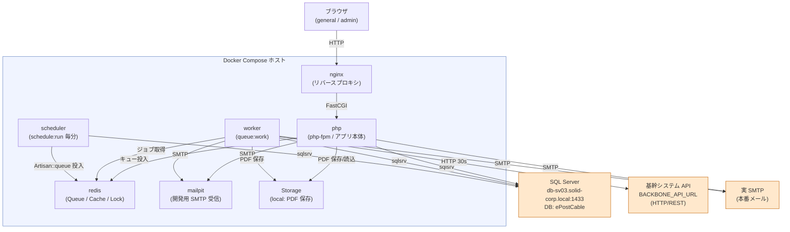

この図の読み方: 点線枠内がコンテナ群、枠外が外部システム。矢印方向が通信の起点を示す。開発環境では RealSMTP の代わりに mailpit が SMTP を受信する。

---

## 2. コンポーネント層構造図

Laravel アプリケーションの層構造と、各層の依存方向を示す。上位層から下位層への単方向依存を原則とする。

```mermaid
graph TD
    subgraph RouteMiddleware["Routes / Middleware 層"]
        RM1["web.php (ルーティング)"]
        RM2["auth Middleware"]
        RM3["admin Middleware"]
        RM4["VerifyCsrfToken"]
    end

    subgraph ControllerLayer["Controller 層 (FR-07〜13 / FR-16 / FR-17)"]
        C1["DashboardController"]
        C2["InvoiceController"]
        C3["DeliveryNoteController"]
        C4["SendMailLogController"]
        C5["ShipmentFetchLogController"]
        C6["UserController"]
        C7["SystemSettingController"]
        C8["LoginController"]
    end

    subgraph CommandLayer["Command 層 (FR-01〜04)"]
        CMD1["FetchShipmentData\nbatch:fetch-shipment-data"]
        CMD2["SendInvoices\nbatch:send-invoices"]
        CMD3["SendDeliveryNotes\nbatch:send-delivery-notes"]
    end

    subgraph JobLayer["Job 層 (FR-05 / FR-06)"]
        J1["ProcessInvoiceJob"]
        J2["ProcessDeliveryNoteJob"]
    end

    subgraph ServiceLayer["Service 層"]
        S1["ShipmentFetchService\n(基幹API取得)"]
        S2["PdfService\n(DomPDF PDF生成)"]
    end

    subgraph MailLayer["Mail 層 (FR-14)"]
        M1["InvoiceMail"]
        M2["DeliveryNoteMail"]
        M3["BatchSummaryMail"]
        M4["TestMail"]
    end

    subgraph ModelLayer["Model 層 (BR-01〜09)"]
        MO1["Invoice / DeliveryNote"]
        MO2["invoice_items / delivery_note_items"]
        MO3["SendMailLog / SendMailLogItem"]
        MO4["ShipmentFetchLog"]
        MO5["SystemSetting (KVS)"]
        MO6["User"]
    end

    subgraph InfraLayer["Infrastructure 層"]
        I1["SQL Server (sqlsrv)"]
        I2["Redis (Queue / Lock)"]
        I3["Storage (local PDF)"]
        I4["SMTP / Mailpit"]
    end

    RouteMiddleware --> ControllerLayer
    ControllerLayer --> CommandLayer
    ControllerLayer --> JobLayer
    ControllerLayer --> ServiceLayer
    ControllerLayer --> ModelLayer
    ControllerLayer --> MailLayer
    CommandLayer --> ServiceLayer
    CommandLayer --> JobLayer
    CommandLayer --> ModelLayer
    CommandLayer --> MailLayer
    JobLayer --> ServiceLayer
    JobLayer --> ModelLayer
    JobLayer --> MailLayer
    ServiceLayer --> ModelLayer
    ModelLayer --> InfraLayer
    ServiceLayer --> InfraLayer
    MailLayer --> InfraLayer

    style RouteMiddleware fill:#e8f0e8,stroke:#40a040
    style ControllerLayer fill:#e8f0ff,stroke:#4060c0
    style CommandLayer fill:#fff0e0,stroke:#c08000
    style JobLayer fill:#fff0e0,stroke:#c08000
    style ServiceLayer fill:#f0e8ff,stroke:#8040c0
    style MailLayer fill:#ffe8f0,stroke:#c04080
    style ModelLayer fill:#e8fff0,stroke:#008060
    style InfraLayer fill:#f8f8f8,stroke:#808080
```

この図の読み方: 矢印は「依存する方向（呼び出す方向）」を示す。InfraLayer が最下位で、上位層は下位層を呼び出すが逆方向の依存は持たない。

---

## 3. 全体データフロー図（E2E）

出荷取得から書類作成、送信バッチ、キュージョブ、メール送信までの End-to-End フローを示す。

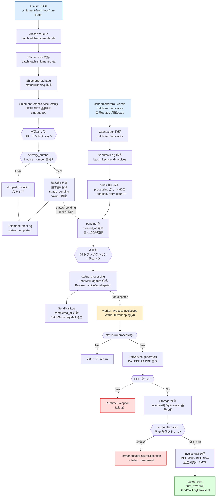

この図の読み方: 上段が出荷取得フロー、中段が送信バッチフロー、下段がキュージョブフロー。点線矢印はフロー間のデータ受け渡し（pending 書類の蓄積）を示す。

---

## 4. 書類ステータス状態遷移図

Invoice / DeliveryNote の `status` カラムが取りうる状態と遷移条件を示す。`status` が処理進行の単一情報源となる。

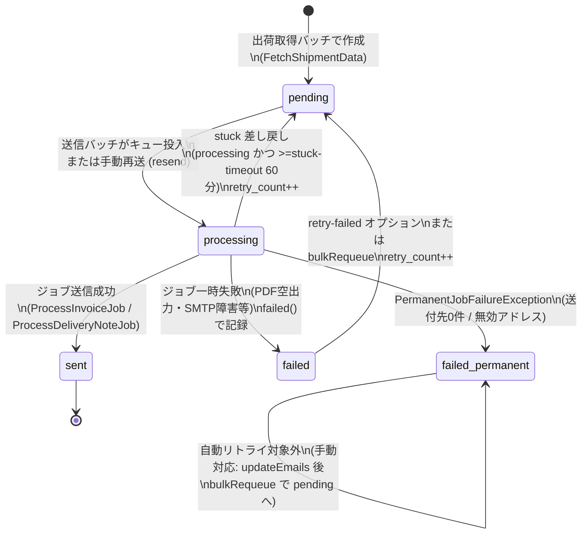

この図の読み方: 通常フローは pending → processing → sent。失敗時は failed または failed_permanent へ分岐し、failed は retry で pending に戻せる。failed_permanent は手動是正が必要。

---

## 5. 出荷取得ログ（ShipmentFetchLog）状態遷移図

出荷取得バッチ実行ごとに作成される ShipmentFetchLog の状態遷移を示す。

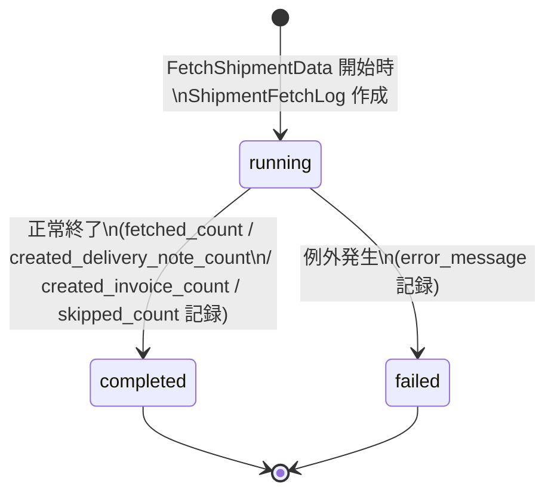

この図の読み方: 実行開始で running、正常完了で completed、例外発生で failed となる。ログは読み取り専用で状態が戻ることはない。

---

## 6. 送信ログ（SendMailLog）displayStatus 判定遷移図

SendMailLog の `displayStatus()` が返す表示ステータスの判定ロジックを示す。`failed_at` の有無が最優先となる。

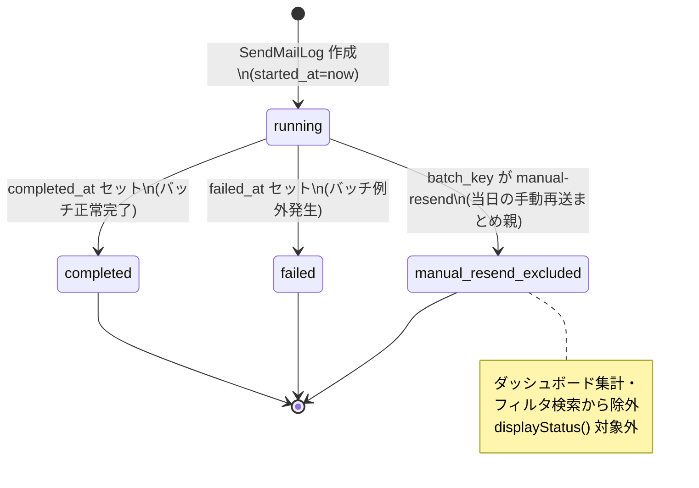

この図の読み方: running は `completed_at` と `failed_at` の両方が null の状態。failed_at が設定された場合は completed_at の有無にかかわらず failed と判定される。manual-resend は集計対象外。

---

## 7. ER 図（主要テーブルのリレーション）

主要テーブルの関係を示す。SendMailLogItem はポリモーフィック関連により Invoice と DeliveryNote の両方に紐づく。

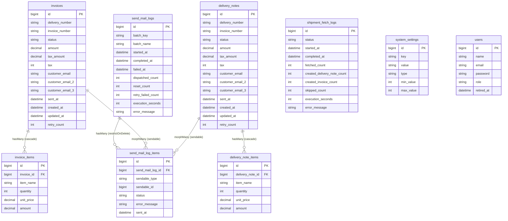

この図の読み方: `send_mail_log_items` の `sendable_type` / `sendable_id` がポリモーフィック外部キーであり、Invoice または DeliveryNote のどちらにも関連できる。親 SendMailLog（まとめ親含む）は削除不可（restrictOnDelete）。削除機能が存在・計画もないため、孤立明細の発生を防ぐ方針とした（2026-07-01決定・Q-06）。

---

## 8. シーケンス図: 出荷取得バッチ（FR-01）

Admin が管理画面からバッチを手動起動し、基幹 API から出荷データを取得して書類を作成するフローを示す。

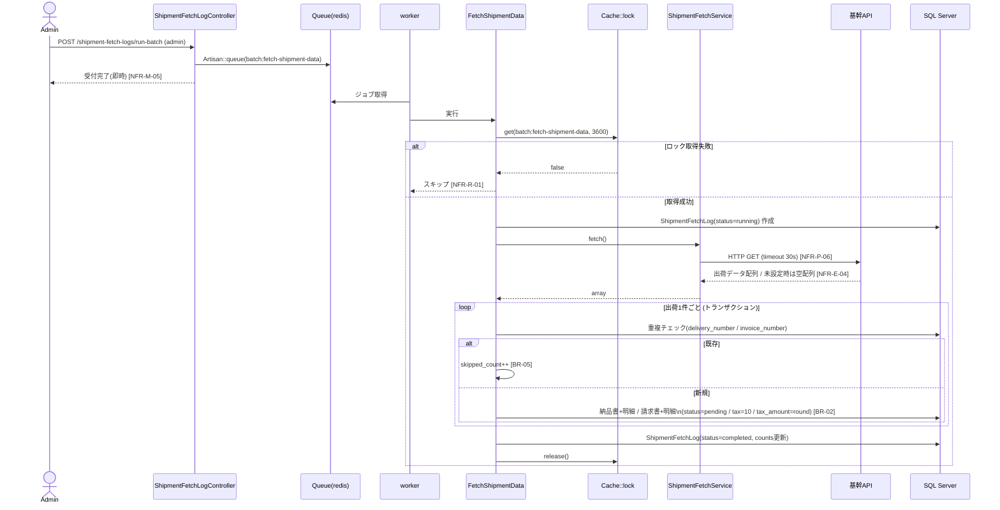

この図の読み方: 管理画面からの操作は即時に受付完了を返し、実際のバッチ処理は worker が非同期で実行する。ロック取得失敗時は多重起動をスキップする。

---

## 9. シーケンス図: 送信バッチ→キュージョブ投入（FR-02/03/04）

スケジューラまたは Admin が送信バッチを起動し、pending の書類を ProcessInvoiceJob としてキューに投入するフローを示す。

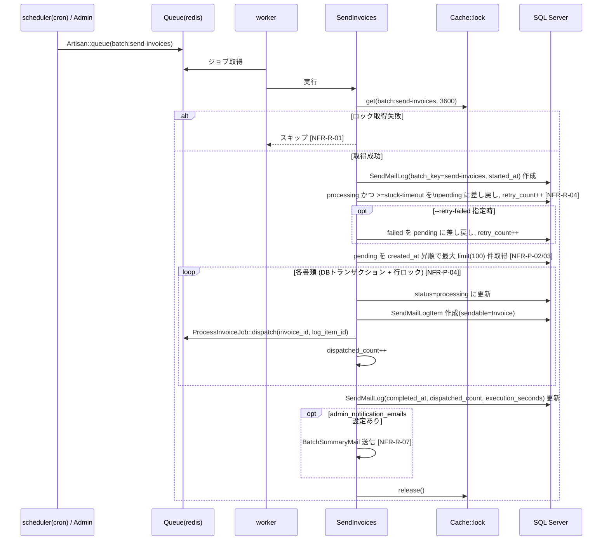

この図の読み方: stuck 差し戻し処理（processing 残留の救済）が pending 取得の前に実行される点が重要。行ロック（lockForUpdate）により複数ワーカーが同一書類を処理しない。

---

## 10. シーケンス図: キュージョブ実行（FR-05/06）

worker が ProcessInvoiceJob を実行し、PDF 生成・保存・メール送信・ステータス更新を行うフローを示す。

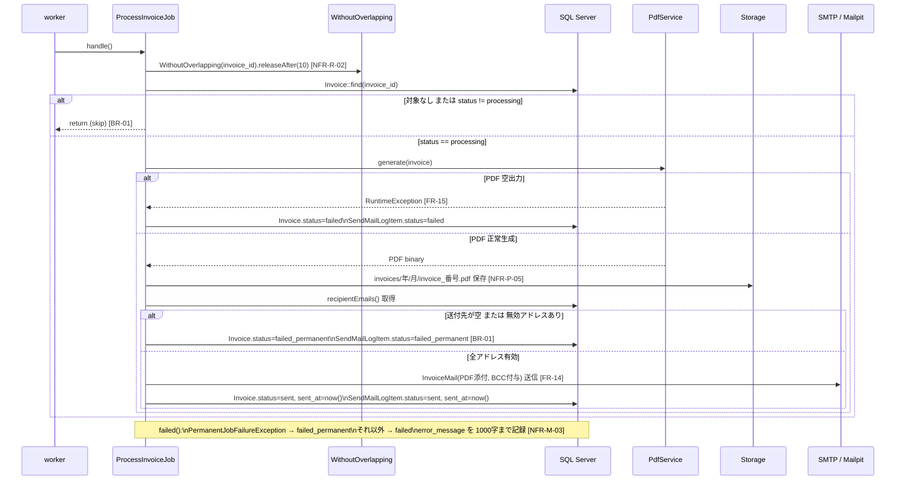

この図の読み方: status ガード（processing 以外はスキップ）が二重処理防止の最終防衛線。PDF 生成失敗と送付先問題で failed/failed_permanent に分岐する。

---

## 11. シーケンス図: 手動再送（FR-08 / BR-07）

一般ユーザーまたは管理者が失敗した書類を画面から手動で再送するフローを示す。

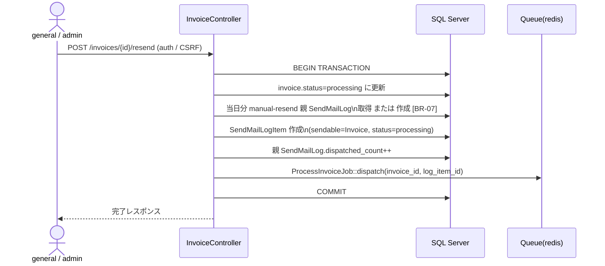

この図の読み方: 当日中の手動再送は1つの manual-resend 親ログにまとめられる（BR-07）。CSRF トークンが必須で、認証済みユーザーのみ操作可能。

---

## 12. シーケンス図: ログイン・認証フロー（FR-16 / NFR-S）

ユーザーのログイン時における試行制限・認証・退職者チェックのフローを示す。

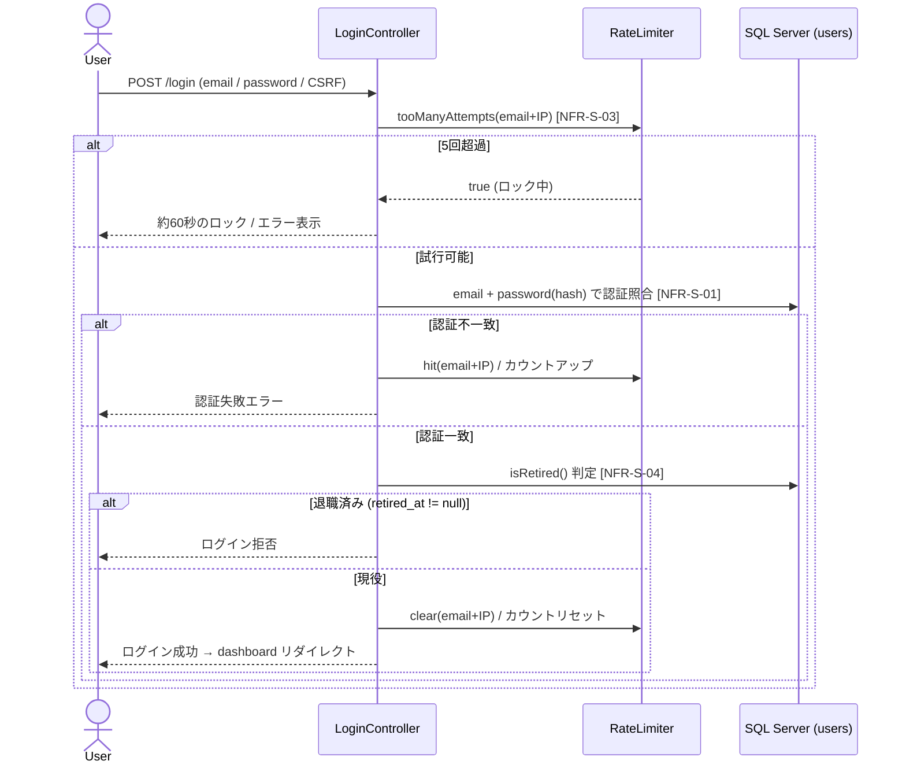

この図の読み方: 試行制限チェックが認証より先に実行される。成功時はカウンタをリセットし、退職者は認証成功後でも画面へ進めない。

---

## 13. 管理画面レイアウト構成図（FA-01）

管理画面の全体レイアウト（サイドナビ＋ヘッダー＋メインコンテンツ）の構成と、サイドナビのメニュー項目を示す（`design/basic-design.md` 第5A章参照）。ログイン画面のみ共通レイアウトを継承しない単独ページとなる。

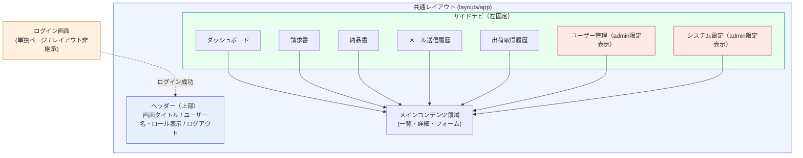

この図の読み方: ログイン画面のみサイドナビ・ヘッダーを持たない単独ページ。ログイン成功後は共通レイアウトへ遷移し、以降の全管理画面（ダッシュボード〜システム設定）はサイドナビ＋ヘッダー＋メインコンテンツの構成を継承する。ユーザー管理・システム設定はadminロール時のみサイドナビに表示（表示制御はUI補助であり、保護の本体は`auth`/`admin`ミドルウェア）。実装はTailwind標準ユーティリティクラスのみで構成し、追加コンポーネントライブラリは使用しない。

---

## 付録: スケジュール定義一覧

scheduler コンテナが `schedule:run` を毎分実行し、以下のコマンドを定時起動する。

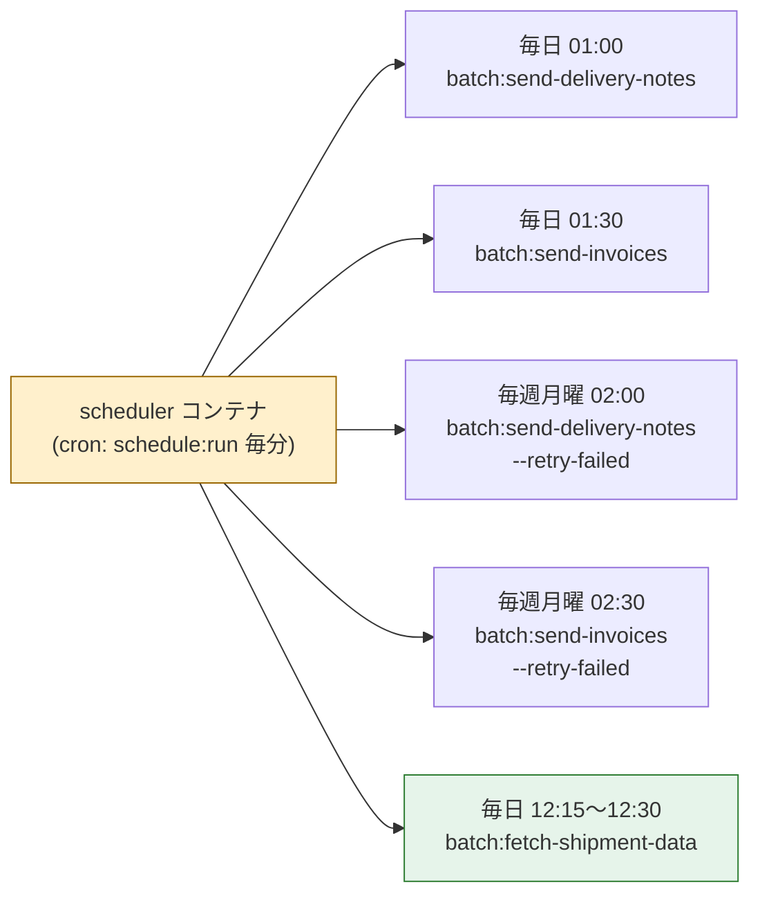

この図の読み方: 各コマンドは `withoutOverlapping()` + `runInBackground()` 修飾により重複起動を防止する。出荷取得バッチは基幹システムの請求データ確定（翌日12:00）からのバッファを見て12:15〜12:30に自動実行する（2026-07-01決定。失敗時は管理画面から手動起動で救済）。

---

## 変更履歴

- 2026-07-07 機能追加 FA-01: 管理画面のUIデザイン方針追加（サイドナビ＋ヘッダー＋メインコンテンツ構成）に伴い「13. 管理画面レイアウト構成図（FA-01）」を新規追加。既存の図は変更なし。
